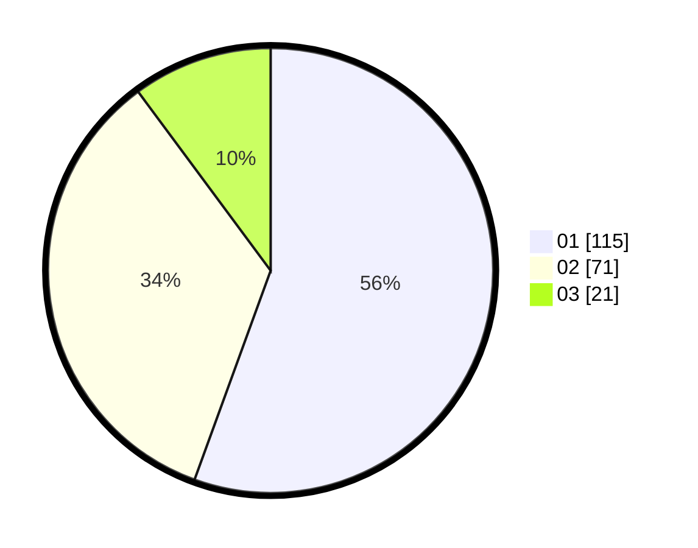

# Hasil

Hasil perolehan suara paslon dapat dilihat pada file paslon-01.txt, paslon-02.txt, dan paslon-03.txt.

Jika tidak ada, artinya data tersebut belum ada pada SIREKAP.

## Perolehan Suara

 * Paslon 01: **115**.
 * Paslon 02: **71**.
 * Paslon 03: **21**.

## Foto C Plano

https://sirekap-obj-formc.kpu.go.id/c6a1/pemilu/ppwp/31/73/04/10/04/3173041004007-20240218-212242--23661e58-355a-4c15-82b3-7087936da15b.jpg

https://sirekap-obj-formc.kpu.go.id/c6a1/pemilu/ppwp/31/73/04/10/04/3173041004007-20240218-211610--e6c3dc1f-5971-4b8a-9b4f-cf49f56d150a.jpg
