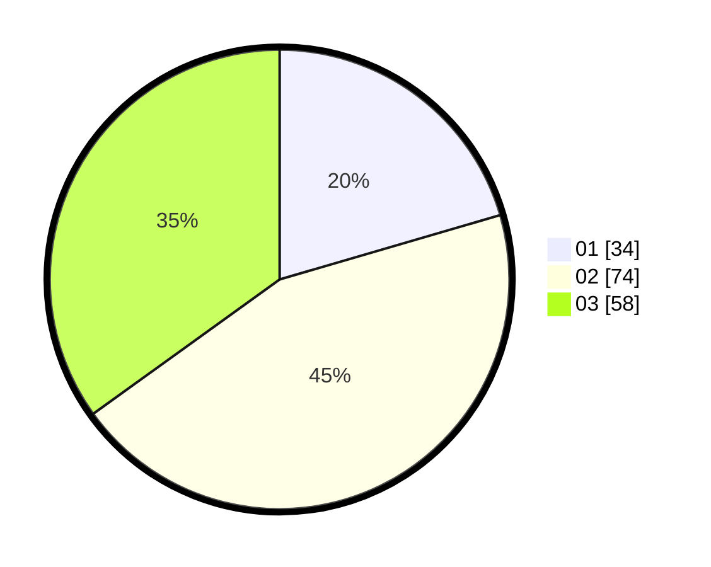

# Hasil

Hasil perolehan suara paslon dapat dilihat pada file paslon-01.txt, paslon-02.txt, dan paslon-03.txt.

Jika tidak ada, artinya data tersebut belum ada pada SIREKAP.

## Perolehan Suara

 * Paslon 01: **34**.
 * Paslon 02: **74**.
 * Paslon 03: **58**.

## Foto C Plano

https://sirekap-obj-formc.kpu.go.id/9a91/pemilu/ppwp/31/73/04/10/04/3173041004010-20240214-223410--10a76b3c-89f7-41ab-9c29-2a83efe7ea33.jpg

https://sirekap-obj-formc.kpu.go.id/9a91/pemilu/ppwp/31/73/04/10/04/3173041004010-20240214-223416--6a00a25c-d35c-4253-a39a-1288647dc006.jpg

https://sirekap-obj-formc.kpu.go.id/9a91/pemilu/ppwp/31/73/04/10/04/3173041004010-20240214-223420--a3e92c60-d3c4-4a21-abfb-174f3989b2cd.jpg
