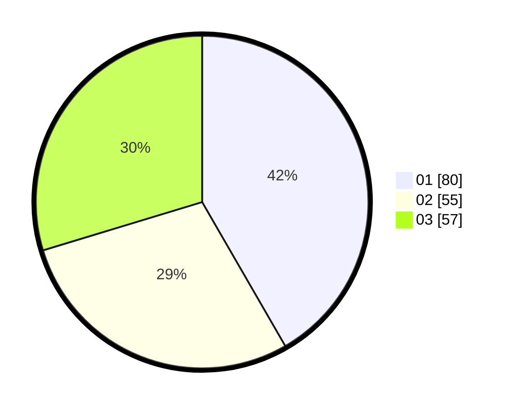

# Hasil

Hasil perolehan suara paslon dapat dilihat pada file paslon-01.txt, paslon-02.txt, dan paslon-03.txt.

Jika tidak ada, artinya data tersebut belum ada pada SIREKAP.

## Perolehan Suara

 * Paslon 01: **80**.
 * Paslon 02: **55**.
 * Paslon 03: **57**.

## Foto C Plano

https://sirekap-obj-formc.kpu.go.id/c7f9/pemilu/ppwp/31/73/04/10/04/3173041004017-20240214-204315--9f1b8f77-3622-49fe-87aa-23e745ce9beb.jpg

https://sirekap-obj-formc.kpu.go.id/c7f9/pemilu/ppwp/31/73/04/10/04/3173041004017-20240214-204427--4493ce79-fa6c-4965-be95-70bb62b23042.jpg

https://sirekap-obj-formc.kpu.go.id/c7f9/pemilu/ppwp/31/73/04/10/04/3173041004017-20240214-204524--ad6b643e-c45c-4226-9b2d-ec06db0c8cd0.jpg

## DATA PEMILIH TETAP

Jumlah pemilih dalam DPT: **263**.
 * L: **131**.
 * P: **132**.

## DATA PENGGUNA HAK PILIH

Jumlah pengguna hak pilih dalam DPT: **208**.
 * L: **103**.
 * P: **105**.

Jumlah pengguna hak pilih dalam DPTb: **0**.
 * L: **0**.
 * P: **0**.

Jumlah pengguna hak pilih dalam DPK: **0**.
 * L: **0**.
 * P: **0**.

Jumlah pengguna hak pilih: **208**.
 * L: **103**.
 * P: **105**.

## JUMLAH SUARA SAH DAN TIDAK SAH

JUMLAH SELURUH SUARA SAH: **205**.

JUMLAH SUARA TIDAK SAH: **3**.

JUMLAH SELURUH SUARA SAH DAN SUARA TIDAK SAH: **208**.
