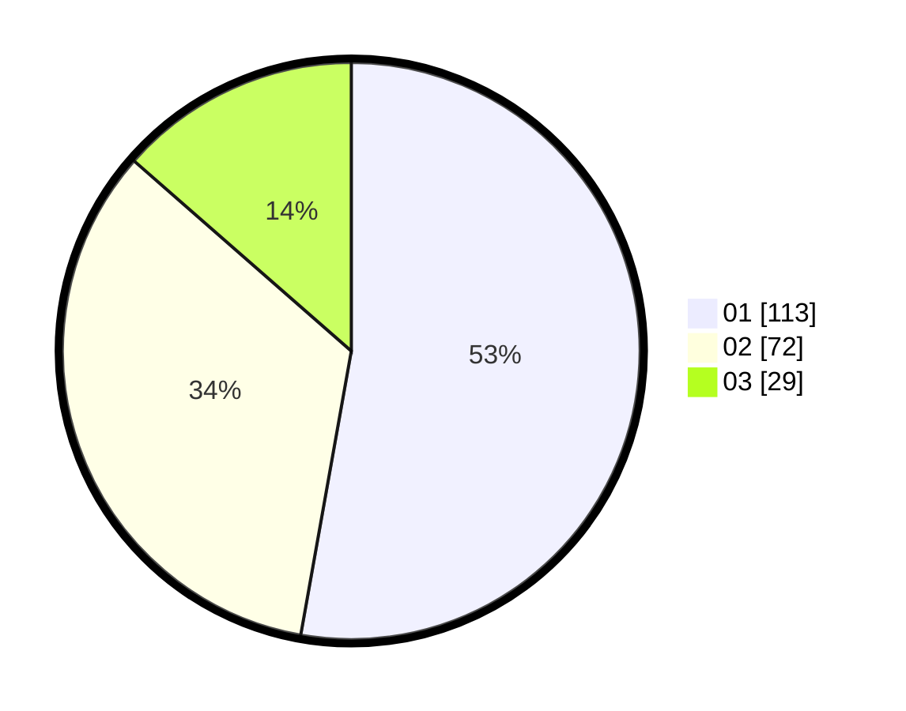

# Hasil

Hasil perolehan suara paslon dapat dilihat pada file paslon-01.txt, paslon-02.txt, dan paslon-03.txt.

Jika tidak ada, artinya data tersebut belum ada pada SIREKAP.

## Perolehan Suara

 * Paslon 01: **113**.
 * Paslon 02: **72**.
 * Paslon 03: **29**.

## Foto C Plano

https://sirekap-obj-formc.kpu.go.id/db7a/pemilu/ppwp/31/73/04/10/04/3173041004019-20240215-000611--c7413b1e-53b5-46bd-bff7-29315de0e6ee.jpg

https://sirekap-obj-formc.kpu.go.id/db7a/pemilu/ppwp/31/73/04/10/04/3173041004019-20240215-000734--e83e5036-ab68-4e7c-84d8-97437fd936f2.jpg

https://sirekap-obj-formc.kpu.go.id/db7a/pemilu/ppwp/31/73/04/10/04/3173041004019-20240215-000942--7eb6b9ed-55ad-4ab0-a204-c4d385a9e786.jpg
