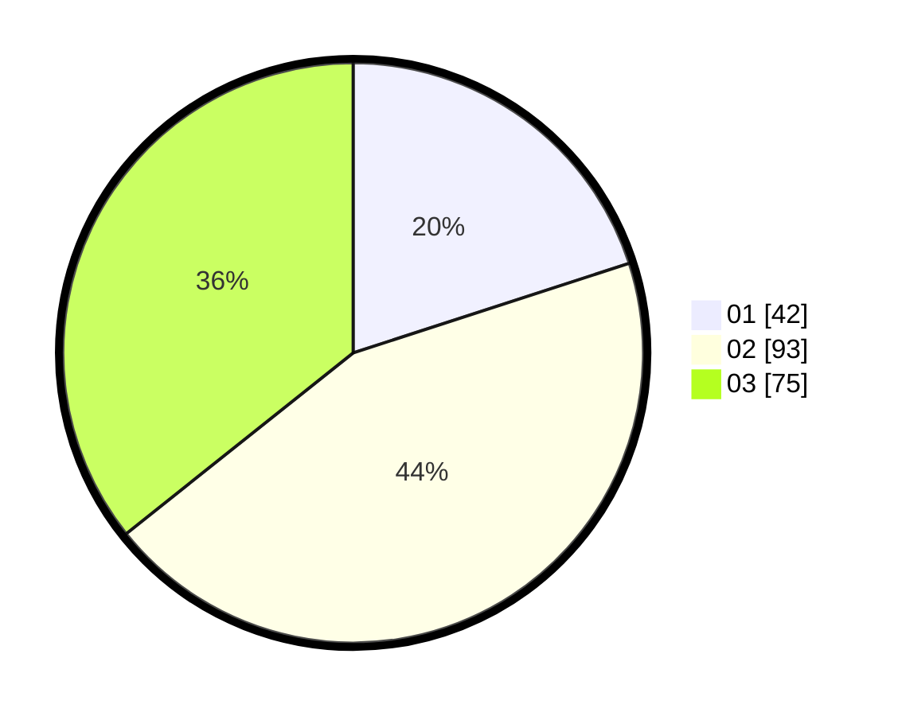

# Hasil

Hasil perolehan suara paslon dapat dilihat pada file paslon-01.txt, paslon-02.txt, dan paslon-03.txt.

Jika tidak ada, artinya data tersebut belum ada pada SIREKAP.

## Perolehan Suara

 * Paslon 01: **42**.
 * Paslon 02: **93**.
 * Paslon 03: **75**.

## Foto C Plano

https://sirekap-obj-formc.kpu.go.id/fcc3/pemilu/ppwp/31/73/04/10/04/3173041004020-20240214-232952--f1ef805a-c350-495e-82d7-af6f2d349171.jpg

https://sirekap-obj-formc.kpu.go.id/fcc3/pemilu/ppwp/31/73/04/10/04/3173041004020-20240214-232949--44fc1ab7-ca33-4de4-9978-9d2ceee63c46.jpg

https://sirekap-obj-formc.kpu.go.id/fcc3/pemilu/ppwp/31/73/04/10/04/3173041004020-20240214-233034--53aa7744-81b8-495d-a322-6b072a6c199a.jpg
