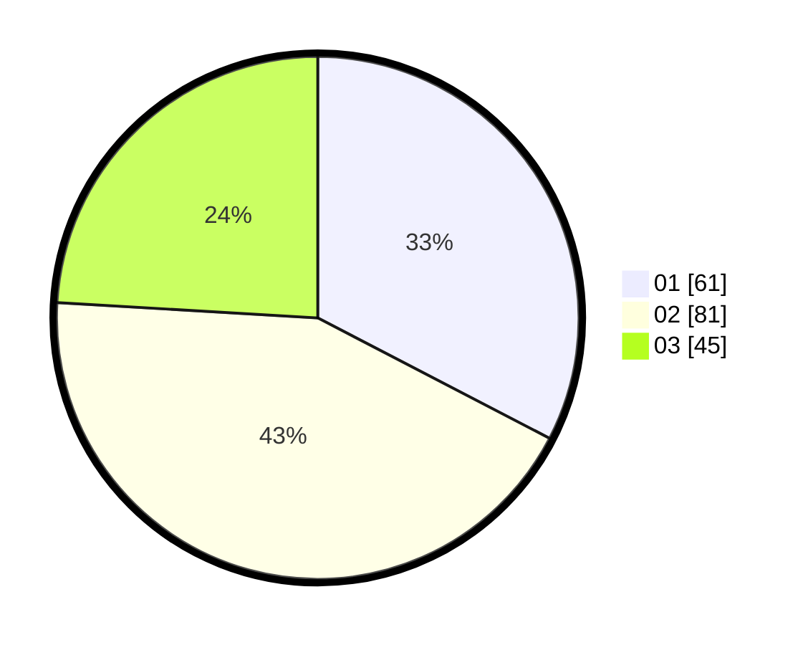

# Hasil

Hasil perolehan suara paslon dapat dilihat pada file paslon-01.txt, paslon-02.txt, dan paslon-03.txt.

Jika tidak ada, artinya data tersebut belum ada pada SIREKAP.

## Perolehan Suara

 * Paslon 01: **61**.
 * Paslon 02: **81**.
 * Paslon 03: **45**.

## Foto C Plano

https://sirekap-obj-formc.kpu.go.id/5a4d/pemilu/ppwp/31/73/04/10/04/3173041004022-20240214-225407--efb5be79-860c-4929-acf3-c33ec222394b.jpg

https://sirekap-obj-formc.kpu.go.id/5a4d/pemilu/ppwp/31/73/04/10/04/3173041004022-20240214-224756--0178d198-49c4-4c43-9ab0-58eeaa7fe20e.jpg

https://sirekap-obj-formc.kpu.go.id/5a4d/pemilu/ppwp/31/73/04/10/04/3173041004022-20240214-224936--94b94ad8-5a96-4993-9ac4-e76fc6caefa3.jpg
