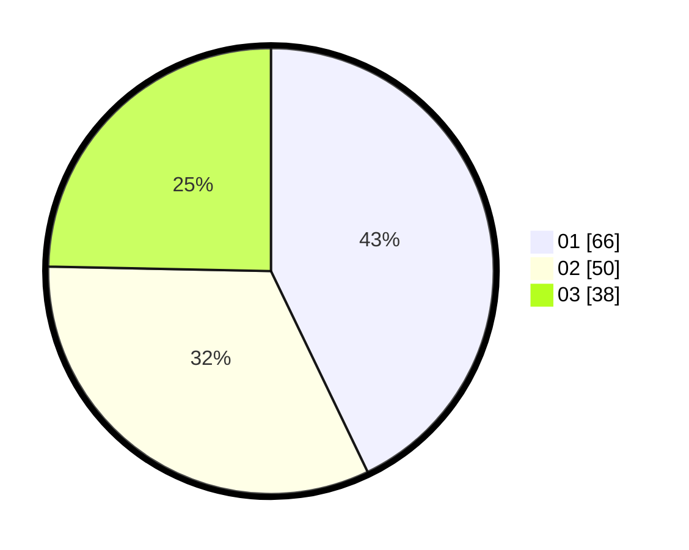

# Hasil

Hasil perolehan suara paslon dapat dilihat pada file paslon-01.txt, paslon-02.txt, dan paslon-03.txt.

Jika tidak ada, artinya data tersebut belum ada pada SIREKAP.

## Perolehan Suara

 * Paslon 01: **66**.
 * Paslon 02: **50**.
 * Paslon 03: **38**.

## Foto C Plano

https://sirekap-obj-formc.kpu.go.id/0822/pemilu/ppwp/31/73/04/10/04/3173041004023-20240214-223029--c02bc844-70f6-463c-8e1f-763efa15c4dc.jpg

https://sirekap-obj-formc.kpu.go.id/0822/pemilu/ppwp/31/73/04/10/04/3173041004023-20240214-214739--b016eae9-6319-4688-b155-446a96265005.jpg

https://sirekap-obj-formc.kpu.go.id/0822/pemilu/ppwp/31/73/04/10/04/3173041004023-20240214-221212--519a3d13-bb97-4ca0-b459-4b40d55af247.jpg
