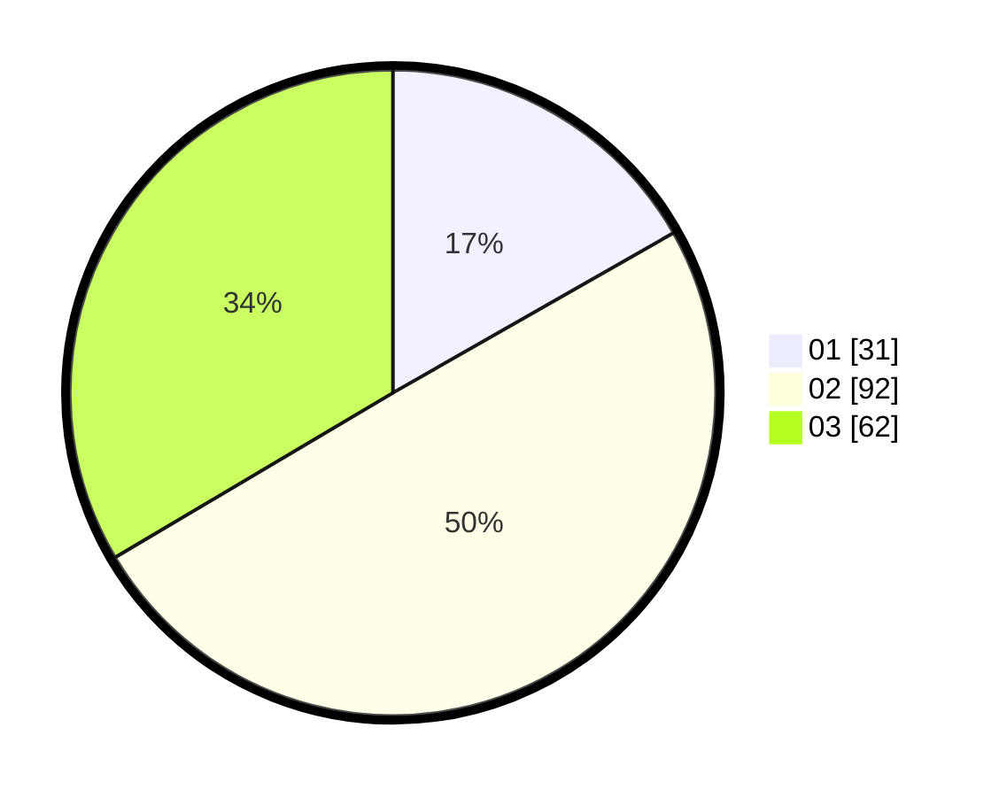

# Hasil

Hasil perolehan suara paslon dapat dilihat pada file paslon-01.txt, paslon-02.txt, dan paslon-03.txt.

Jika tidak ada, artinya data tersebut belum ada pada SIREKAP.

## Perolehan Suara

 * Paslon 01: **31**.
 * Paslon 02: **92**.
 * Paslon 03: **62**.

## Foto C Plano

https://sirekap-obj-formc.kpu.go.id/2ce0/pemilu/ppwp/31/73/04/10/04/3173041004027-20240214-214706--2169901e-1bb8-4e8c-9790-466dff6f2b95.jpg

https://sirekap-obj-formc.kpu.go.id/2ce0/pemilu/ppwp/31/73/04/10/04/3173041004027-20240214-215231--3f1dadc8-fcae-4682-9283-47410747fcd0.jpg

https://sirekap-obj-formc.kpu.go.id/2ce0/pemilu/ppwp/31/73/04/10/04/3173041004027-20240214-215431--830a36d7-32ec-4387-9f10-583ad59aa853.jpg
