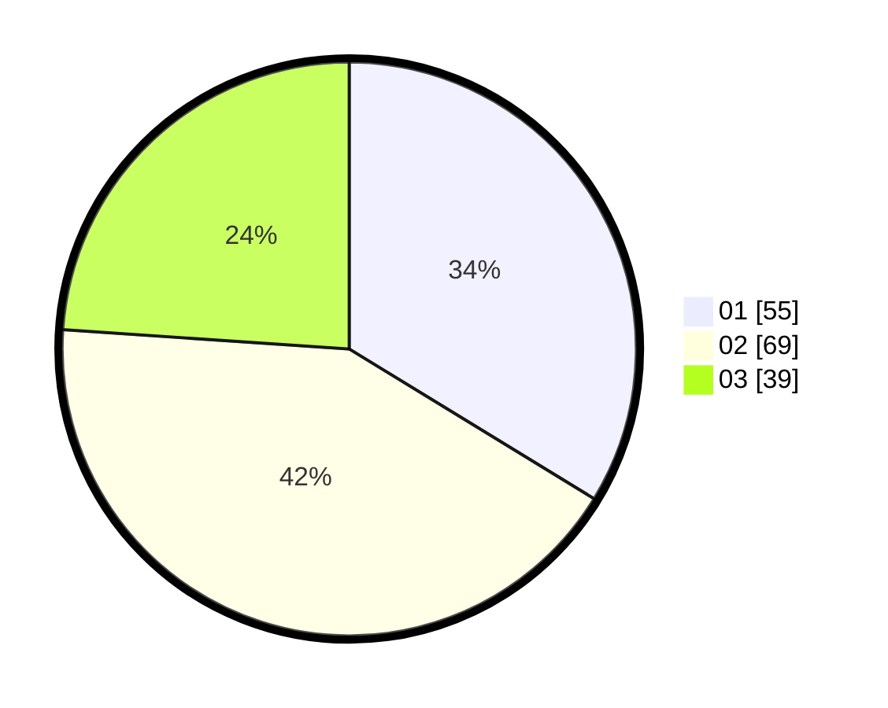

# Hasil

Hasil perolehan suara paslon dapat dilihat pada file paslon-01.txt, paslon-02.txt, dan paslon-03.txt.

Jika tidak ada, artinya data tersebut belum ada pada SIREKAP.

## Perolehan Suara

 * Paslon 01: **55**.
 * Paslon 02: **69**.
 * Paslon 03: **39**.

## Foto C Plano

https://sirekap-obj-formc.kpu.go.id/82dd/pemilu/ppwp/31/73/04/10/04/3173041004029-20240214-190617--fcc93cf4-5aad-48c6-996c-965fb05925c6.jpg

https://sirekap-obj-formc.kpu.go.id/82dd/pemilu/ppwp/31/73/04/10/04/3173041004029-20240214-190620--09a0a839-8c2f-43bc-baef-c10a448805d8.jpg

https://sirekap-obj-formc.kpu.go.id/82dd/pemilu/ppwp/31/73/04/10/04/3173041004029-20240215-195505--e5ac1757-c702-4ea9-98df-248e8a53e194.jpg
