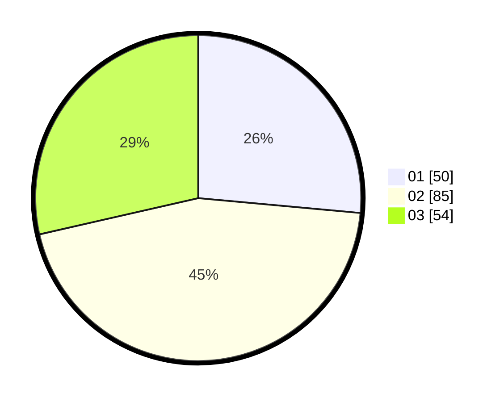

# Hasil

Hasil perolehan suara paslon dapat dilihat pada file paslon-01.txt, paslon-02.txt, dan paslon-03.txt.

Jika tidak ada, artinya data tersebut belum ada pada SIREKAP.

## Perolehan Suara

 * Paslon 01: **50**.
 * Paslon 02: **85**.
 * Paslon 03: **54**.

## Foto C Plano

https://sirekap-obj-formc.kpu.go.id/f91c/pemilu/ppwp/31/73/04/10/04/3173041004031-20240217-003512--abaa6864-5203-49de-ad6d-065934f524ab.jpg

https://sirekap-obj-formc.kpu.go.id/f91c/pemilu/ppwp/31/73/04/10/04/3173041004031-20240215-003720--ee08b6e1-13b7-4307-813a-3c87aff7d3f1.jpg

https://sirekap-obj-formc.kpu.go.id/f91c/pemilu/ppwp/31/73/04/10/04/3173041004031-20240215-003808--f7ad38d7-acd6-4430-82f6-6676feaa9c5a.jpg
