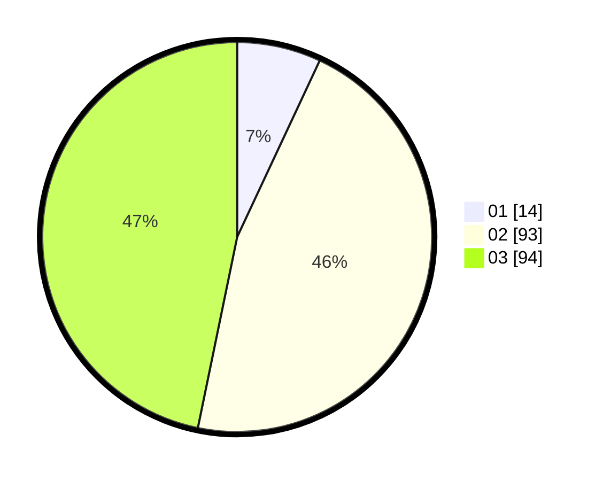

# Hasil

Hasil perolehan suara paslon dapat dilihat pada file paslon-01.txt, paslon-02.txt, dan paslon-03.txt.

Jika tidak ada, artinya data tersebut belum ada pada SIREKAP.

## Perolehan Suara

 * Paslon 01: **14**.
 * Paslon 02: **93**.
 * Paslon 03: **94**.

## Foto C Plano

https://sirekap-obj-formc.kpu.go.id/48a4/pemilu/ppwp/31/73/04/10/04/3173041004035-20240215-154236--d322b43b-82ee-4250-895f-f62f23eb8868.jpg

https://sirekap-obj-formc.kpu.go.id/48a4/pemilu/ppwp/31/73/04/10/04/3173041004035-20240215-154327--627f8b8f-92c2-47d4-9679-8990284908d8.jpg

https://sirekap-obj-formc.kpu.go.id/48a4/pemilu/ppwp/31/73/04/10/04/3173041004035-20240215-160031--089442fe-e5a2-429b-afb2-ab2c36854551.jpg
