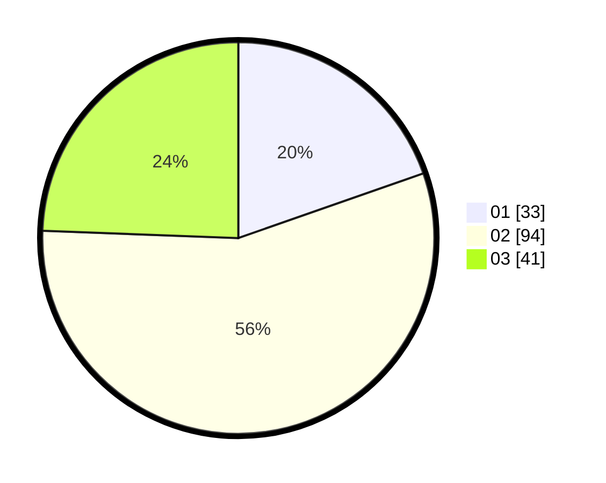

# Hasil

Hasil perolehan suara paslon dapat dilihat pada file paslon-01.txt, paslon-02.txt, dan paslon-03.txt.

Jika tidak ada, artinya data tersebut belum ada pada SIREKAP.

## Perolehan Suara

 * Paslon 01: **33**.
 * Paslon 02: **94**.
 * Paslon 03: **41**.

## Foto C Plano

https://sirekap-obj-formc.kpu.go.id/b0a6/pemilu/ppwp/31/73/04/10/04/3173041004038-20240214-185404--e3faa83c-8209-486f-8599-e97781a327a3.jpg

https://sirekap-obj-formc.kpu.go.id/b0a6/pemilu/ppwp/31/73/04/10/04/3173041004038-20240214-185526--21236097-552a-4b6e-b26f-9c6d4cd0499b.jpg

https://sirekap-obj-formc.kpu.go.id/b0a6/pemilu/ppwp/31/73/04/10/04/3173041004038-20240214-221731--272542c1-5416-437d-a076-46256d90de6b.jpg
