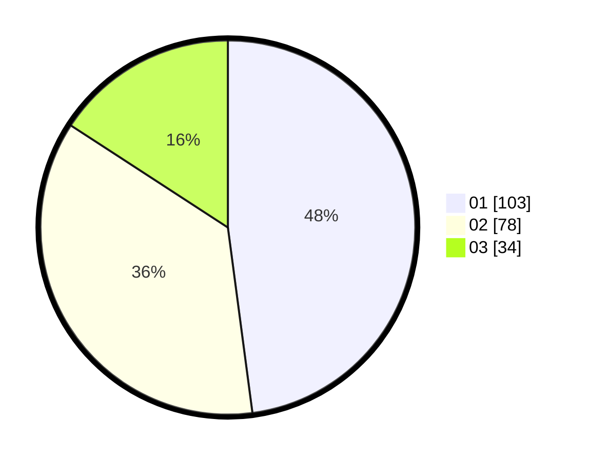

# Hasil

Hasil perolehan suara paslon dapat dilihat pada file paslon-01.txt, paslon-02.txt, dan paslon-03.txt.

Jika tidak ada, artinya data tersebut belum ada pada SIREKAP.

## Perolehan Suara

 * Paslon 01: **103**.
 * Paslon 02: **78**.
 * Paslon 03: **34**.

## Foto C Plano

https://sirekap-obj-formc.kpu.go.id/5de6/pemilu/ppwp/31/73/04/10/04/3173041004043-20240214-230657--b856c9f3-d51b-45db-9daa-467ba06e8b21.jpg

https://sirekap-obj-formc.kpu.go.id/5de6/pemilu/ppwp/31/73/04/10/04/3173041004043-20240214-230839--770898a3-7c2b-4f10-a2ce-512720a568a7.jpg

https://sirekap-obj-formc.kpu.go.id/5de6/pemilu/ppwp/31/73/04/10/04/3173041004043-20240214-231015--911e7018-3367-4faa-a164-2825cf6508ef.jpg
