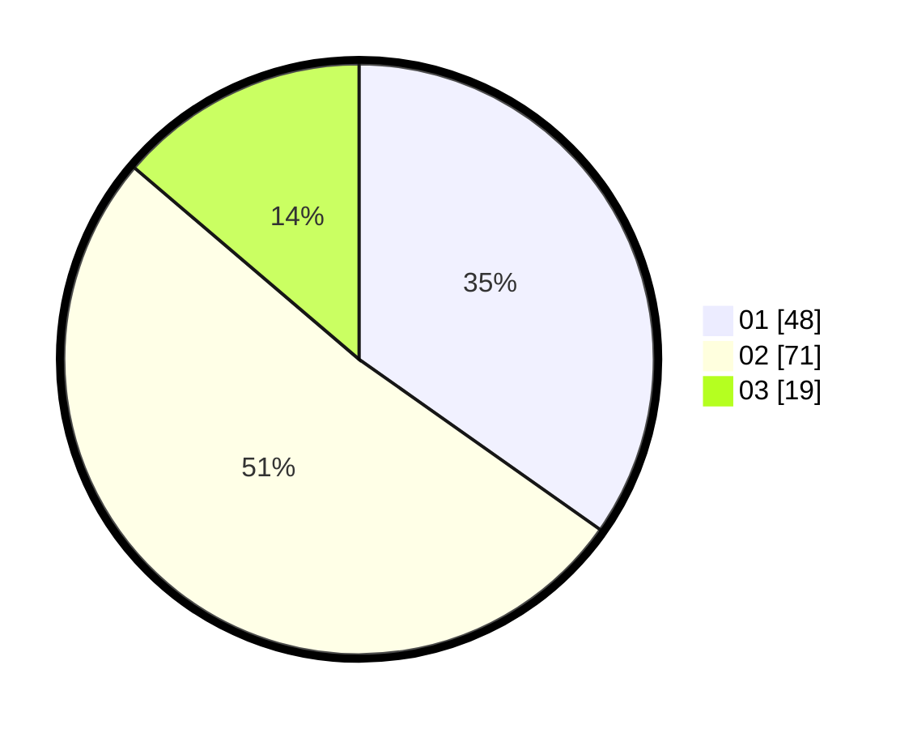

# Hasil

Hasil perolehan suara paslon dapat dilihat pada file paslon-01.txt, paslon-02.txt, dan paslon-03.txt.

Jika tidak ada, artinya data tersebut belum ada pada SIREKAP.

## Perolehan Suara

 * Paslon 01: **48**.
 * Paslon 02: **71**.
 * Paslon 03: **19**.

## Foto C Plano

https://sirekap-obj-formc.kpu.go.id/4185/pemilu/ppwp/31/73/04/10/04/3173041004044-20240214-215133--efe258f9-d522-4f80-b938-83030460c467.jpg

https://sirekap-obj-formc.kpu.go.id/4185/pemilu/ppwp/31/73/04/10/04/3173041004044-20240214-213302--51c607d9-4718-4c97-9ccb-0fa9899e93c1.jpg

https://sirekap-obj-formc.kpu.go.id/4185/pemilu/ppwp/31/73/04/10/04/3173041004044-20240214-213402--6a0054ee-151c-4482-af0a-733fcc4d4a90.jpg
