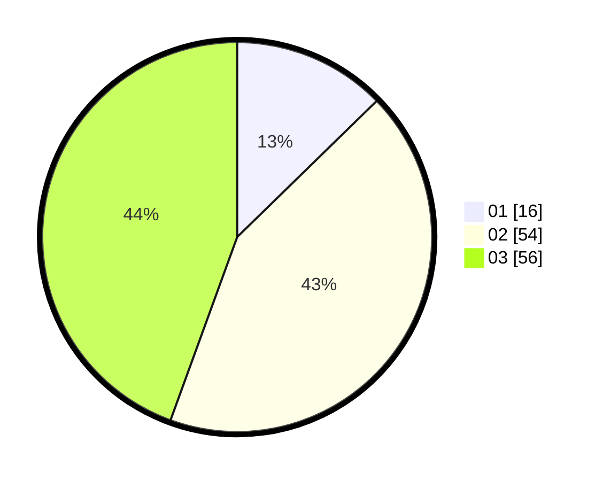

# Hasil

Hasil perolehan suara paslon dapat dilihat pada file paslon-01.txt, paslon-02.txt, dan paslon-03.txt.

Jika tidak ada, artinya data tersebut belum ada pada SIREKAP.

## Perolehan Suara

 * Paslon 01: **16**.
 * Paslon 02: **54**.
 * Paslon 03: **56**.

## Foto C Plano

https://sirekap-obj-formc.kpu.go.id/60fe/pemilu/ppwp/31/73/04/10/04/3173041004045-20240214-215916--5f4826fe-73d8-4e2e-889a-fda0e98ee69b.jpg

https://sirekap-obj-formc.kpu.go.id/60fe/pemilu/ppwp/31/73/04/10/04/3173041004045-20240214-215922--a8fbf152-4cc1-444c-9066-fc97db179895.jpg

https://sirekap-obj-formc.kpu.go.id/60fe/pemilu/ppwp/31/73/04/10/04/3173041004045-20240214-215925--7f41e4a5-ddde-4e96-9964-7a55361ff9ac.jpg
