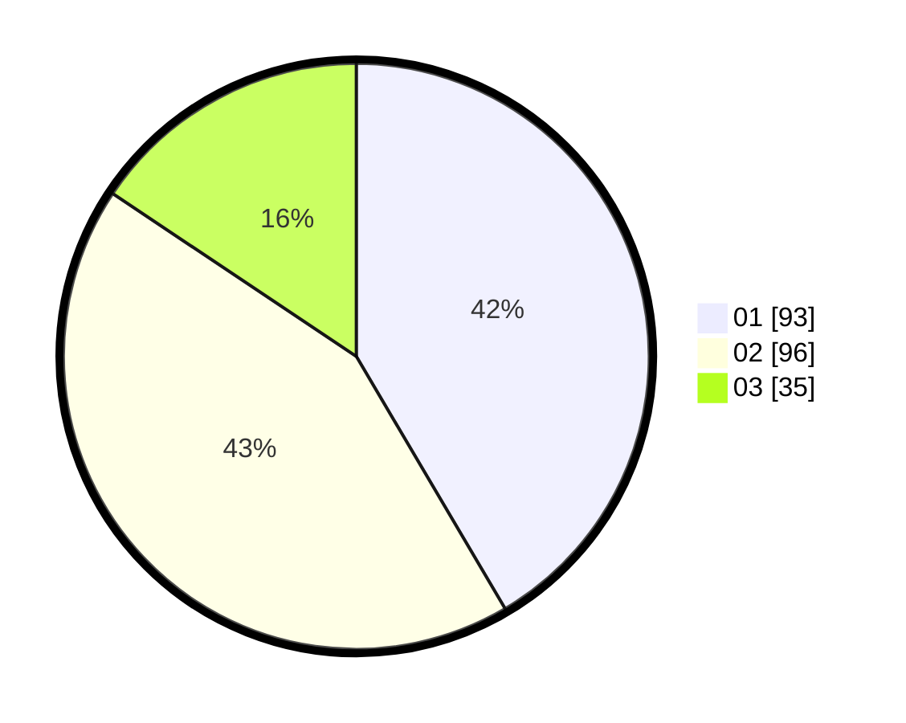

# Hasil

Hasil perolehan suara paslon dapat dilihat pada file paslon-01.txt, paslon-02.txt, dan paslon-03.txt.

Jika tidak ada, artinya data tersebut belum ada pada SIREKAP.

## Perolehan Suara

 * Paslon 01: **93**.
 * Paslon 02: **96**.
 * Paslon 03: **35**.

## Foto C Plano

https://sirekap-obj-formc.kpu.go.id/e937/pemilu/ppwp/31/73/04/10/04/3173041004046-20240214-190845--9e060b6c-af0d-4744-bc7a-277f513a0234.jpg

https://sirekap-obj-formc.kpu.go.id/e937/pemilu/ppwp/31/73/04/10/04/3173041004046-20240214-190857--90b943d9-4c9f-4ae1-8490-3bc837f7bac4.jpg

https://sirekap-obj-formc.kpu.go.id/e937/pemilu/ppwp/31/73/04/10/04/3173041004046-20240214-190904--6af305b5-4d1e-4749-9f0e-56a4055b2b4d.jpg

## DATA PEMILIH TETAP

Jumlah pemilih dalam DPT: **220**.
 * L: **110**.
 * P: **110**.

## DATA PENGGUNA HAK PILIH

Jumlah pengguna hak pilih dalam DPT: **220**.
 * L: **110**.
 * P: **110**.

Jumlah pengguna hak pilih dalam DPTb: **3**.
 * L: **2**.
 * P: **1**.

Jumlah pengguna hak pilih dalam DPK: **4**.
 * L: **1**.
 * P: **3**.

Jumlah pengguna hak pilih: **227**.
 * L: **113**.
 * P: **114**.

## JUMLAH SUARA SAH DAN TIDAK SAH

JUMLAH SELURUH SUARA SAH: **204**.

JUMLAH SUARA TIDAK SAH: **3**.

JUMLAH SELURUH SUARA SAH DAN SUARA TIDAK SAH: **227**.
