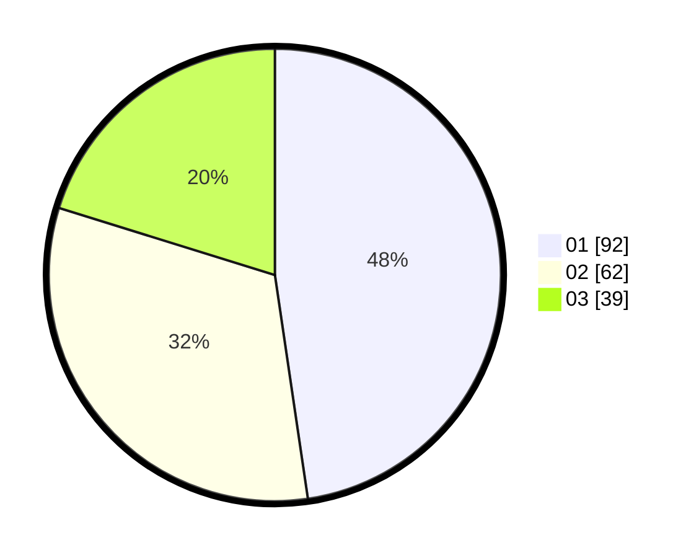

# Hasil

Hasil perolehan suara paslon dapat dilihat pada file paslon-01.txt, paslon-02.txt, dan paslon-03.txt.

Jika tidak ada, artinya data tersebut belum ada pada SIREKAP.

## Perolehan Suara

 * Paslon 01: **92**.
 * Paslon 02: **62**.
 * Paslon 03: **39**.

## Foto C Plano

https://sirekap-obj-formc.kpu.go.id/fb84/pemilu/ppwp/31/73/04/10/04/3173041004047-20240214-231906--79c8971f-26dc-43eb-ba2b-934997894bbb.jpg

https://sirekap-obj-formc.kpu.go.id/fb84/pemilu/ppwp/31/73/04/10/04/3173041004047-20240214-231936--c61f4069-30d6-41f5-bb64-af8b6fb2fa97.jpg

https://sirekap-obj-formc.kpu.go.id/fb84/pemilu/ppwp/31/73/04/10/04/3173041004047-20240214-232014--28640707-f202-4171-a29e-6cf1e7cba708.jpg
