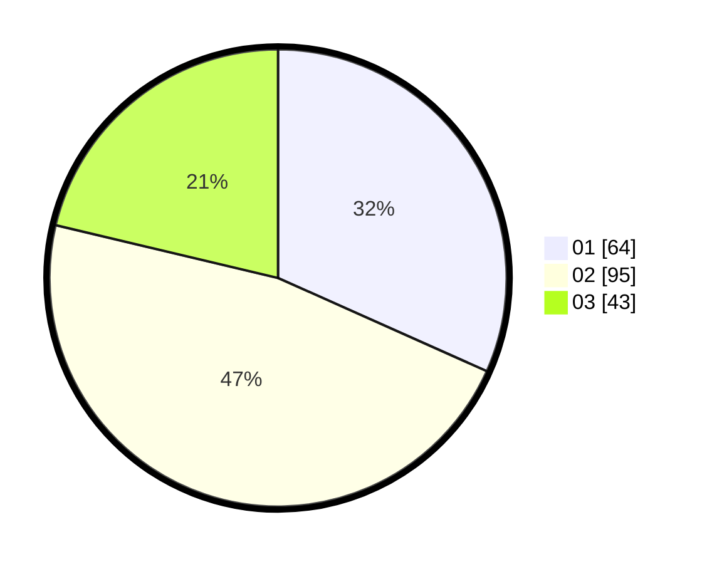

# Hasil

Hasil perolehan suara paslon dapat dilihat pada file paslon-01.txt, paslon-02.txt, dan paslon-03.txt.

Jika tidak ada, artinya data tersebut belum ada pada SIREKAP.

## Perolehan Suara

 * Paslon 01: **64**.
 * Paslon 02: **95**.
 * Paslon 03: **43**.

## Foto C Plano

https://sirekap-obj-formc.kpu.go.id/ab18/pemilu/ppwp/31/73/04/10/04/3173041004049-20240214-221342--b3a9366c-1b21-40d3-bd50-2b8b374d10bc.jpg

https://sirekap-obj-formc.kpu.go.id/ab18/pemilu/ppwp/31/73/04/10/04/3173041004049-20240214-221417--6a0f85bb-50af-4b7f-bc62-eca9e23bd279.jpg

https://sirekap-obj-formc.kpu.go.id/ab18/pemilu/ppwp/31/73/04/10/04/3173041004049-20240214-221522--817cfa7d-bd8e-4a60-9c08-ddde054f4a95.jpg
