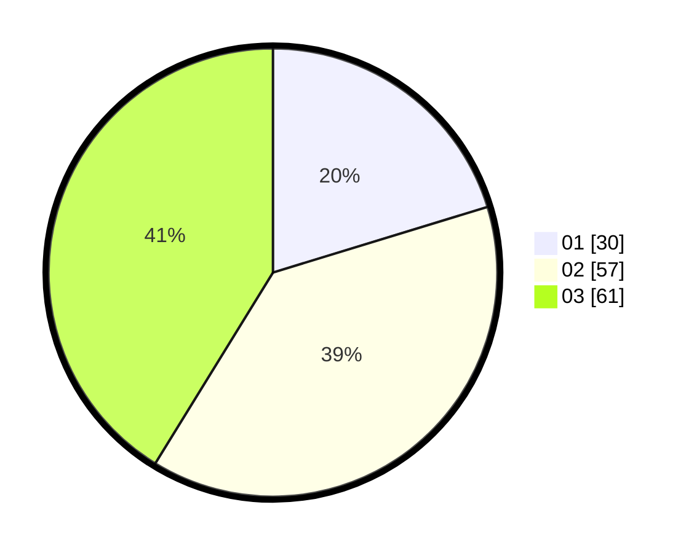

# Hasil

Hasil perolehan suara paslon dapat dilihat pada file paslon-01.txt, paslon-02.txt, dan paslon-03.txt.

Jika tidak ada, artinya data tersebut belum ada pada SIREKAP.

## Perolehan Suara

 * Paslon 01: **30**.
 * Paslon 02: **57**.
 * Paslon 03: **61**.

## Foto C Plano

https://sirekap-obj-formc.kpu.go.id/55d3/pemilu/ppwp/31/73/04/10/04/3173041004050-20240214-234859--2d2483ed-0eab-4c68-92f4-7226f62b86d3.jpg

https://sirekap-obj-formc.kpu.go.id/55d3/pemilu/ppwp/31/73/04/10/04/3173041004050-20240214-204442--632eb311-401c-4b54-8e0b-a8361ec7e8e5.jpg

https://sirekap-obj-formc.kpu.go.id/55d3/pemilu/ppwp/31/73/04/10/04/3173041004050-20240214-204247--5c378744-f71c-4afe-9896-e67674ca1d4c.jpg
