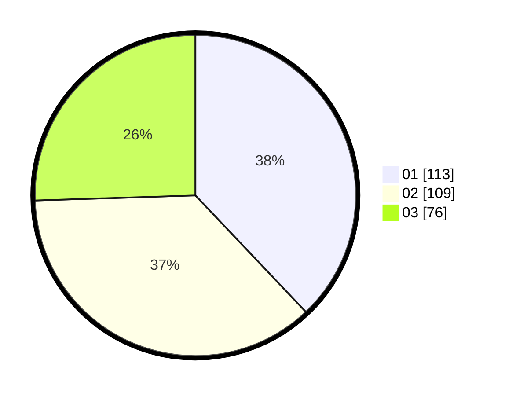

# Hasil

Hasil perolehan suara paslon dapat dilihat pada file paslon-01.txt, paslon-02.txt, dan paslon-03.txt.

Jika tidak ada, artinya data tersebut belum ada pada SIREKAP.

## Perolehan Suara

 * Paslon 01: **113**.
 * Paslon 02: **109**.
 * Paslon 03: **76**.

## Foto C Plano

https://sirekap-obj-formc.kpu.go.id/563b/pemilu/ppwp/31/73/04/10/04/3173041004053-20240214-221646--d76deae4-7404-40d7-a971-2157b9416063.jpg

https://sirekap-obj-formc.kpu.go.id/563b/pemilu/ppwp/31/73/04/10/04/3173041004053-20240214-211714--dc2b0ede-46fb-4918-8d5a-d76e9f9f7671.jpg
