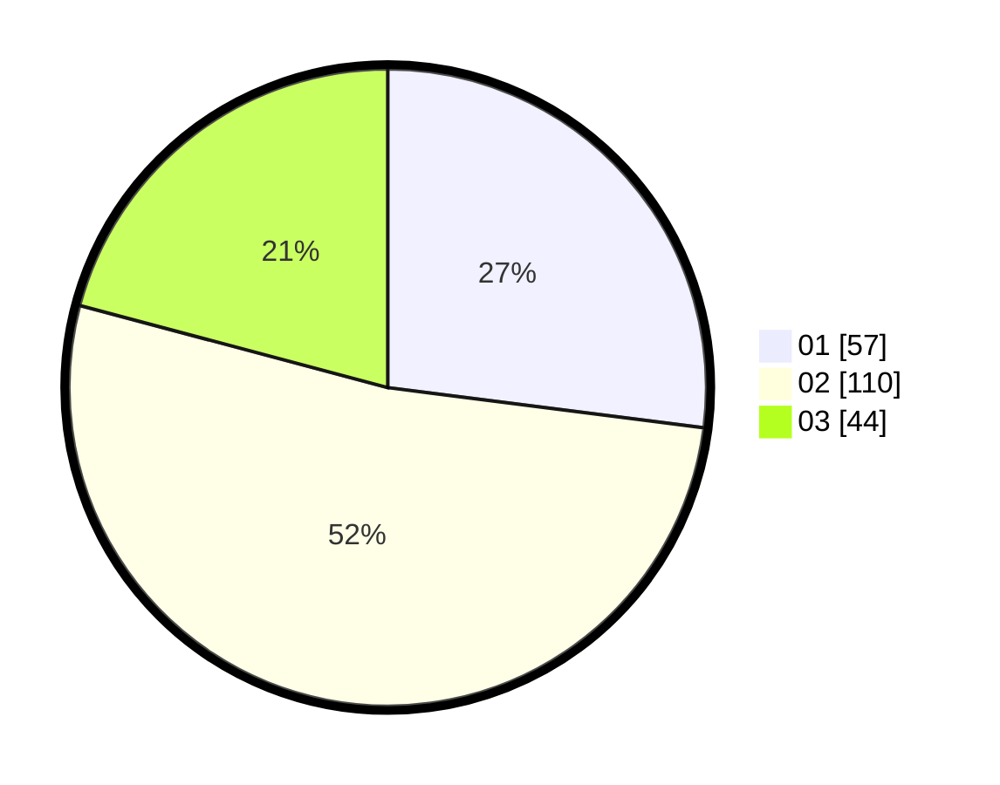

# Hasil

Hasil perolehan suara paslon dapat dilihat pada file paslon-01.txt, paslon-02.txt, dan paslon-03.txt.

Jika tidak ada, artinya data tersebut belum ada pada SIREKAP.

## Perolehan Suara

 * Paslon 01: **57**.
 * Paslon 02: **110**.
 * Paslon 03: **44**.

## Foto C Plano

https://sirekap-obj-formc.kpu.go.id/169d/pemilu/ppwp/31/73/04/10/04/3173041004054-20240215-210617--987e333e-5d0e-4711-b40b-0e3bdb1122da.jpg

https://sirekap-obj-formc.kpu.go.id/169d/pemilu/ppwp/31/73/04/10/04/3173041004054-20240215-210604--7ba96cdf-0eb6-41e3-bc2a-14d4602fa226.jpg
