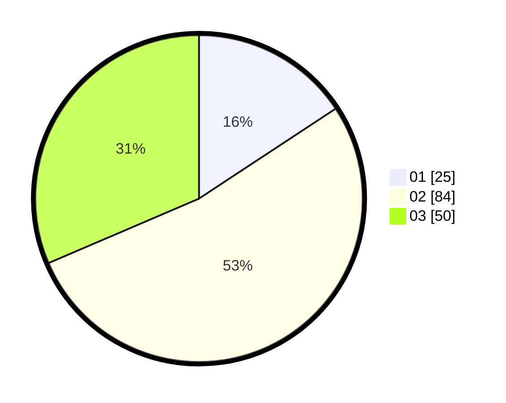

# Hasil

Hasil perolehan suara paslon dapat dilihat pada file paslon-01.txt, paslon-02.txt, dan paslon-03.txt.

Jika tidak ada, artinya data tersebut belum ada pada SIREKAP.

## Perolehan Suara

 * Paslon 01: **25**.
 * Paslon 02: **84**.
 * Paslon 03: **50**.

## Foto C Plano

https://sirekap-obj-formc.kpu.go.id/303c/pemilu/ppwp/31/73/04/10/04/3173041004059-20240214-204742--bcbb3ef1-f201-4b45-aaed-9799396ab7d5.jpg

https://sirekap-obj-formc.kpu.go.id/303c/pemilu/ppwp/31/73/04/10/04/3173041004059-20240214-204843--e19d49ce-42fe-4477-85dc-7978ba39d844.jpg

https://sirekap-obj-formc.kpu.go.id/303c/pemilu/ppwp/31/73/04/10/04/3173041004059-20240214-205044--6d60f0f0-f3fc-4cfd-941a-6443e6dbd1e3.jpg

## DATA PEMILIH TETAP

Jumlah pemilih dalam DPT: **237**.
 * L: **118**.
 * P: **119**.

## DATA PENGGUNA HAK PILIH

Jumlah pengguna hak pilih dalam DPT: **157**.
 * L: **72**.
 * P: **85**.

Jumlah pengguna hak pilih dalam DPTb: **1**.
 * L: **0**.
 * P: **1**.

Jumlah pengguna hak pilih dalam DPK: **4**.
 * L: **3**.
 * P: **1**.

Jumlah pengguna hak pilih: **162**.
 * L: **75**.
 * P: **87**.

## JUMLAH SUARA SAH DAN TIDAK SAH

JUMLAH SELURUH SUARA SAH: **159**.

JUMLAH SUARA TIDAK SAH: **3**.

JUMLAH SELURUH SUARA SAH DAN SUARA TIDAK SAH: **162**.
