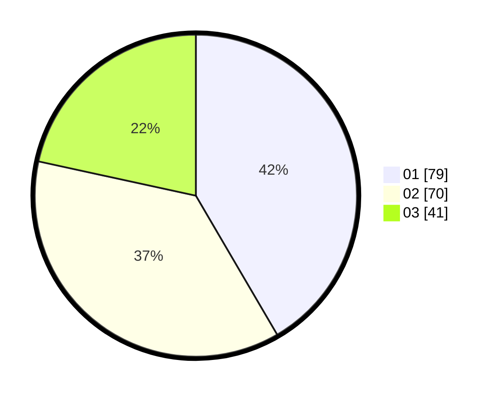

# Hasil

Hasil perolehan suara paslon dapat dilihat pada file paslon-01.txt, paslon-02.txt, dan paslon-03.txt.

Jika tidak ada, artinya data tersebut belum ada pada SIREKAP.

## Perolehan Suara

 * Paslon 01: **79**.
 * Paslon 02: **70**.
 * Paslon 03: **41**.

## Foto C Plano

https://sirekap-obj-formc.kpu.go.id/4111/pemilu/ppwp/31/73/04/10/04/3173041004069-20240215-005317--8e3963df-8965-4ce4-881d-27be31409267.jpg

https://sirekap-obj-formc.kpu.go.id/4111/pemilu/ppwp/31/73/04/10/04/3173041004069-20240215-005414--bbf16e33-0077-46fa-aa2a-21885d30f4d9.jpg

https://sirekap-obj-formc.kpu.go.id/4111/pemilu/ppwp/31/73/04/10/04/3173041004069-20240215-005446--649736ea-c49d-425c-8b18-e5bf831ed4d8.jpg
