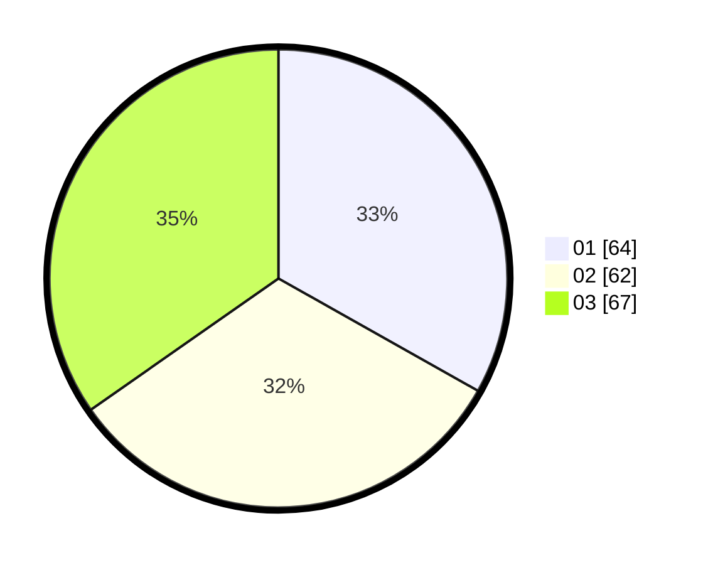

# Hasil

Hasil perolehan suara paslon dapat dilihat pada file paslon-01.txt, paslon-02.txt, dan paslon-03.txt.

Jika tidak ada, artinya data tersebut belum ada pada SIREKAP.

## Perolehan Suara

 * Paslon 01: **64**.
 * Paslon 02: **62**.
 * Paslon 03: **67**.

## Foto C Plano

https://sirekap-obj-formc.kpu.go.id/5f10/pemilu/ppwp/31/73/04/10/04/3173041004073-20240214-220551--5d7fec70-303e-4ae6-b907-bdeccd33bc21.jpg

https://sirekap-obj-formc.kpu.go.id/5f10/pemilu/ppwp/31/73/04/10/04/3173041004073-20240214-220736--9829f8ae-6448-48c0-a22a-6cdef25be18e.jpg

https://sirekap-obj-formc.kpu.go.id/5f10/pemilu/ppwp/31/73/04/10/04/3173041004073-20240214-221112--97208f92-43e3-4d53-8646-5991611aae3a.jpg
