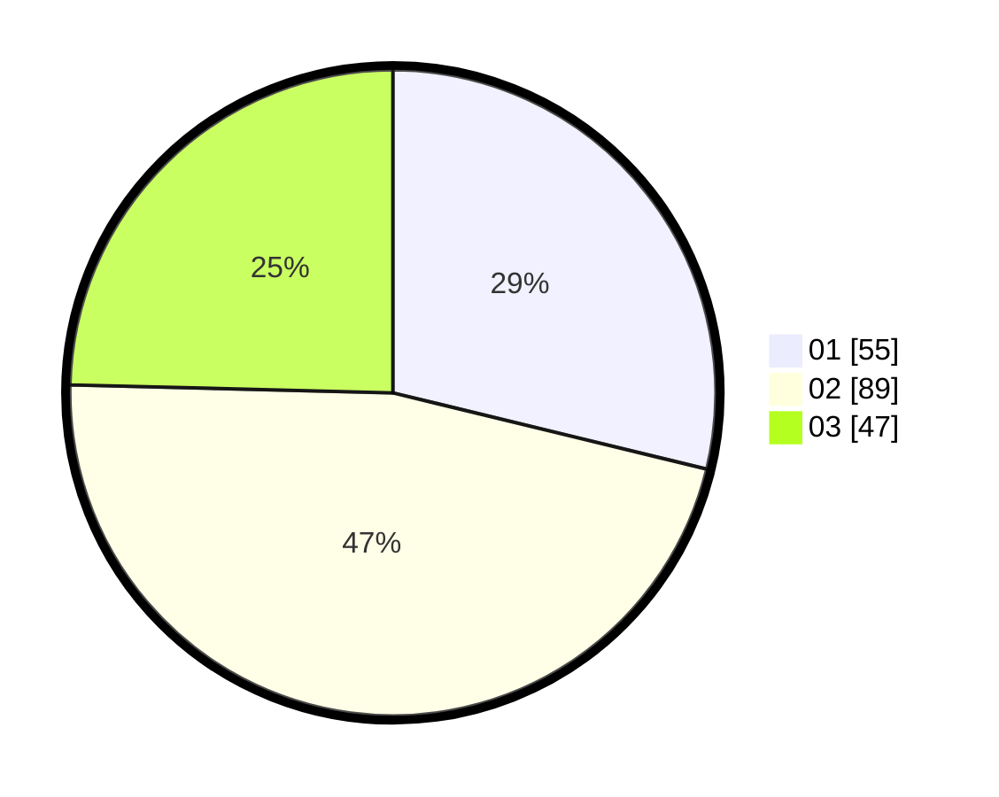

# Hasil

Hasil perolehan suara paslon dapat dilihat pada file paslon-01.txt, paslon-02.txt, dan paslon-03.txt.

Jika tidak ada, artinya data tersebut belum ada pada SIREKAP.

## Perolehan Suara

 * Paslon 01: **55**.
 * Paslon 02: **89**.
 * Paslon 03: **47**.

## Foto C Plano

https://sirekap-obj-formc.kpu.go.id/c33c/pemilu/ppwp/31/73/04/10/04/3173041004080-20240214-221054--2f4f98d5-83e6-45c8-8c79-8bdb5dd77eb5.jpg

https://sirekap-obj-formc.kpu.go.id/c33c/pemilu/ppwp/31/73/04/10/04/3173041004080-20240214-230807--140ba590-c0ac-439e-b908-e059dc53e182.jpg

https://sirekap-obj-formc.kpu.go.id/c33c/pemilu/ppwp/31/73/04/10/04/3173041004080-20240214-230930--d287f255-a646-429e-8df2-b67bb70a656c.jpg
