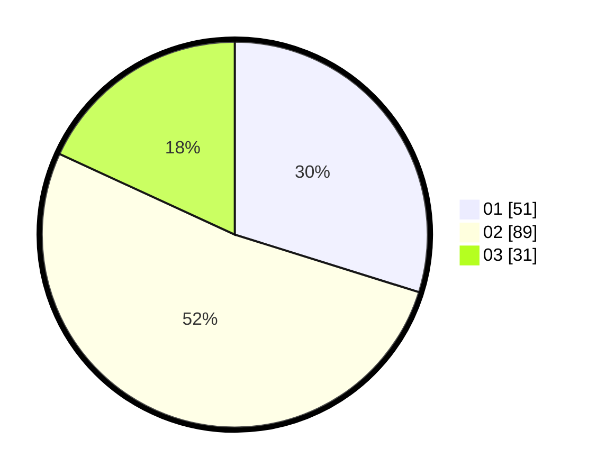

# Hasil

Hasil perolehan suara paslon dapat dilihat pada file paslon-01.txt, paslon-02.txt, dan paslon-03.txt.

Jika tidak ada, artinya data tersebut belum ada pada SIREKAP.

## Perolehan Suara

 * Paslon 01: **51**.
 * Paslon 02: **89**.
 * Paslon 03: **31**.

## Foto C Plano

https://sirekap-obj-formc.kpu.go.id/67c6/pemilu/ppwp/31/73/04/10/04/3173041004081-20240215-014231--dc6a67ac-2912-4e7a-abb3-d8fc4ff948e2.jpg

https://sirekap-obj-formc.kpu.go.id/67c6/pemilu/ppwp/31/73/04/10/04/3173041004081-20240215-014355--e6eee664-9770-4952-9c2f-9dc1a15912af.jpg

https://sirekap-obj-formc.kpu.go.id/67c6/pemilu/ppwp/31/73/04/10/04/3173041004081-20240215-014458--a5058687-c50b-49e6-8662-a2a482e47383.jpg
