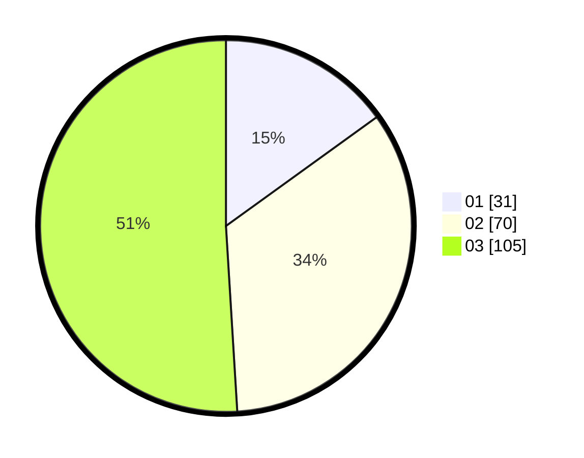

# Hasil

Hasil perolehan suara paslon dapat dilihat pada file paslon-01.txt, paslon-02.txt, dan paslon-03.txt.

Jika tidak ada, artinya data tersebut belum ada pada SIREKAP.

## Perolehan Suara

 * Paslon 01: **31**.
 * Paslon 02: **70**.
 * Paslon 03: **105**.

## Foto C Plano

https://sirekap-obj-formc.kpu.go.id/c607/pemilu/ppwp/31/73/04/10/04/3173041004082-20240214-155818--9c9f043d-02b2-4c88-98fb-db35e5e5e73d.jpg
