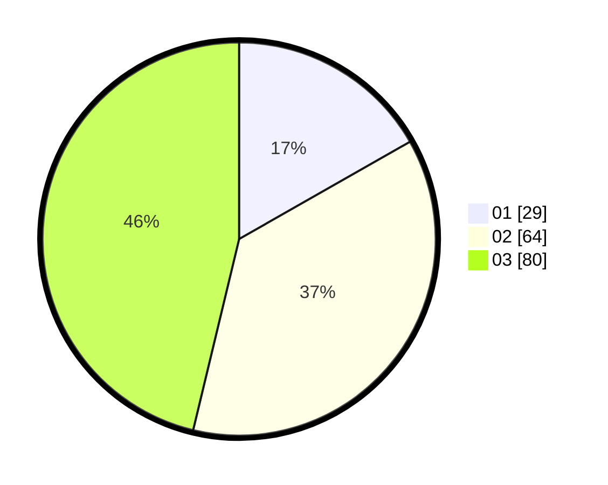

# Hasil

Hasil perolehan suara paslon dapat dilihat pada file paslon-01.txt, paslon-02.txt, dan paslon-03.txt.

Jika tidak ada, artinya data tersebut belum ada pada SIREKAP.

## Perolehan Suara

 * Paslon 01: **29**.
 * Paslon 02: **64**.
 * Paslon 03: **80**.

## Foto C Plano

https://sirekap-obj-formc.kpu.go.id/a4eb/pemilu/ppwp/31/73/04/10/04/3173041004084-20240214-203403--98445c0c-5a1c-4d05-bb72-7e4e2b5b5d39.jpg

https://sirekap-obj-formc.kpu.go.id/a4eb/pemilu/ppwp/31/73/04/10/04/3173041004084-20240214-203956--4ae50a68-7f21-416d-9a10-6efd49a84b54.jpg

https://sirekap-obj-formc.kpu.go.id/a4eb/pemilu/ppwp/31/73/04/10/04/3173041004084-20240214-203850--68ef4e2f-5515-4635-91a1-a92ac8f08ffa.jpg

## DATA PEMILIH TETAP

Jumlah pemilih dalam DPT: **227**.
 * L: **103**.
 * P: **124**.

## DATA PENGGUNA HAK PILIH

Jumlah pengguna hak pilih dalam DPT: **171**.
 * L: **78**.
 * P: **93**.

Jumlah pengguna hak pilih dalam DPTb: **0**.
 * L: **0**.
 * P: **0**.

Jumlah pengguna hak pilih dalam DPK: **8**.
 * L: **4**.
 * P: **4**.

Jumlah pengguna hak pilih: **179**.
 * L: **82**.
 * P: **97**.

## JUMLAH SUARA SAH DAN TIDAK SAH

JUMLAH SELURUH SUARA SAH: **173**.

JUMLAH SUARA TIDAK SAH: **6**.

JUMLAH SELURUH SUARA SAH DAN SUARA TIDAK SAH: **179**.
