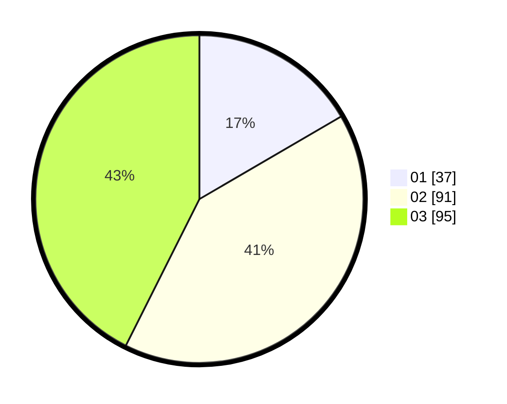

# Hasil

Hasil perolehan suara paslon dapat dilihat pada file paslon-01.txt, paslon-02.txt, dan paslon-03.txt.

Jika tidak ada, artinya data tersebut belum ada pada SIREKAP.

## Perolehan Suara

 * Paslon 01: **37**.
 * Paslon 02: **91**.
 * Paslon 03: **95**.

## Foto C Plano

https://sirekap-obj-formc.kpu.go.id/4137/pemilu/ppwp/31/73/04/10/04/3173041004088-20240215-001000--d24e968b-0ed4-43c6-8cfb-ebec55da82d9.jpg

https://sirekap-obj-formc.kpu.go.id/4137/pemilu/ppwp/31/73/04/10/04/3173041004088-20240215-001039--cc3f8ae6-2265-4d62-a0a6-bfba93c87a99.jpg

https://sirekap-obj-formc.kpu.go.id/4137/pemilu/ppwp/31/73/04/10/04/3173041004088-20240215-001142--fc2696a9-b25c-4729-a84d-872f50e78709.jpg
