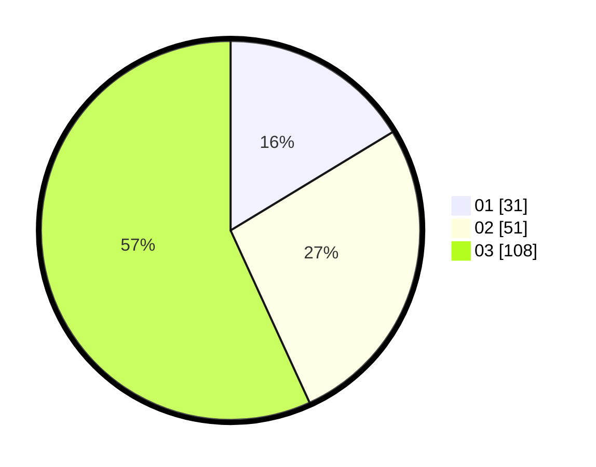

# Hasil

Hasil perolehan suara paslon dapat dilihat pada file paslon-01.txt, paslon-02.txt, dan paslon-03.txt.

Jika tidak ada, artinya data tersebut belum ada pada SIREKAP.

## Perolehan Suara

 * Paslon 01: **31**.
 * Paslon 02: **51**.
 * Paslon 03: **108**.

## Foto C Plano

https://sirekap-obj-formc.kpu.go.id/658c/pemilu/ppwp/31/73/04/10/04/3173041004089-20240214-223247--d54ca037-2a9a-4fe3-bac9-c431fde3baf0.jpg

https://sirekap-obj-formc.kpu.go.id/658c/pemilu/ppwp/31/73/04/10/04/3173041004089-20240214-223337--cd07ca8c-bcf5-4a0f-8de1-a73a1d40efe2.jpg

https://sirekap-obj-formc.kpu.go.id/658c/pemilu/ppwp/31/73/04/10/04/3173041004089-20240215-030245--b7ed8614-f8a2-4288-ab84-117276966740.jpg

## DATA PEMILIH TETAP

Jumlah pemilih dalam DPT: **277**.
 * L: **149**.
 * P: **128**.

## DATA PENGGUNA HAK PILIH

Jumlah pengguna hak pilih dalam DPT: **189**.
 * L: **101**.
 * P: **88**.

Jumlah pengguna hak pilih dalam DPTb: **7**.
 * L: **4**.
 * P: **3**.

Jumlah pengguna hak pilih dalam DPK: **4**.
 * L: **1**.
 * P: **3**.

Jumlah pengguna hak pilih: **200**.
 * L: **106**.
 * P: **94**.

## JUMLAH SUARA SAH DAN TIDAK SAH

JUMLAH SELURUH SUARA SAH: **190**.

JUMLAH SUARA TIDAK SAH: **10**.

JUMLAH SELURUH SUARA SAH DAN SUARA TIDAK SAH: **200**.
