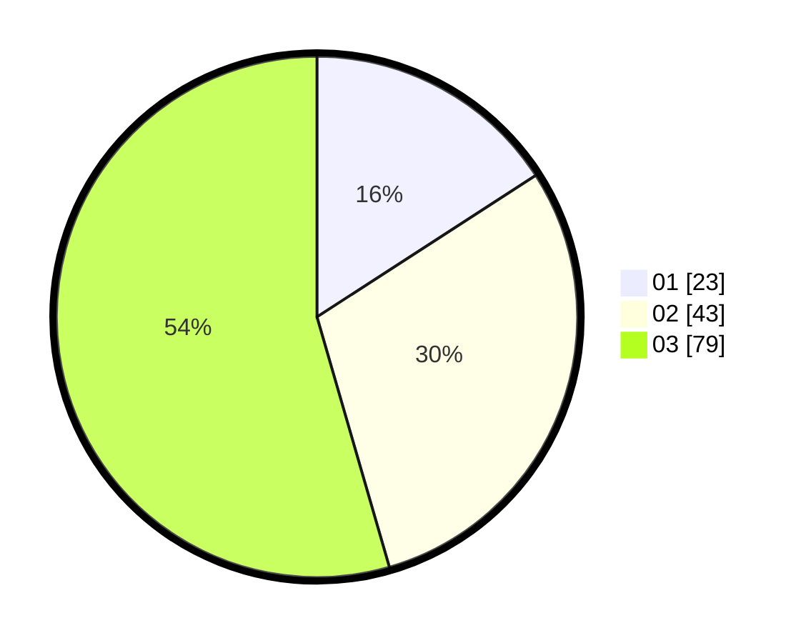

# Hasil

Hasil perolehan suara paslon dapat dilihat pada file paslon-01.txt, paslon-02.txt, dan paslon-03.txt.

Jika tidak ada, artinya data tersebut belum ada pada SIREKAP.

## Perolehan Suara

 * Paslon 01: **23**.
 * Paslon 02: **43**.
 * Paslon 03: **79**.

## Foto C Plano

https://sirekap-obj-formc.kpu.go.id/faa9/pemilu/ppwp/31/73/04/10/04/3173041004090-20240215-003250--bf297ec2-3b57-4bcd-a138-358067ca3ed1.jpg

https://sirekap-obj-formc.kpu.go.id/faa9/pemilu/ppwp/31/73/04/10/04/3173041004090-20240214-233240--8703187b-818c-453c-ab11-6a1cf2ecb939.jpg

https://sirekap-obj-formc.kpu.go.id/faa9/pemilu/ppwp/31/73/04/10/04/3173041004090-20240215-003506--5f085132-3193-45b5-a59a-9ce5a5809cd4.jpg

## DATA PEMILIH TETAP

Jumlah pemilih dalam DPT: **147**.
 * L: **65**.
 * P: **82**.

## DATA PENGGUNA HAK PILIH

Jumlah pengguna hak pilih dalam DPT: **141**.
 * L: **63**.
 * P: **78**.

Jumlah pengguna hak pilih dalam DPTb: **2**.
 * L: **1**.
 * P: **1**.

Jumlah pengguna hak pilih dalam DPK: **4**.
 * L: **1**.
 * P: **3**.

Jumlah pengguna hak pilih: **147**.
 * L: **65**.
 * P: **82**.

## JUMLAH SUARA SAH DAN TIDAK SAH

JUMLAH SELURUH SUARA SAH: **145**.

JUMLAH SUARA TIDAK SAH: **2**.

JUMLAH SELURUH SUARA SAH DAN SUARA TIDAK SAH: **147**.
