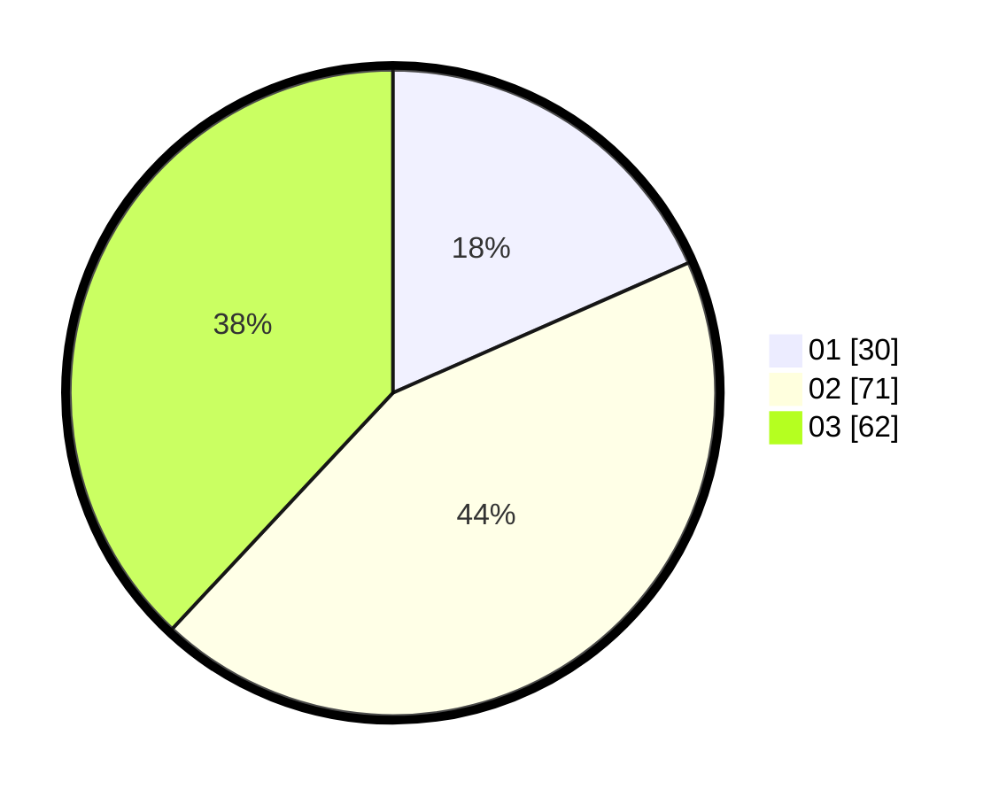

# Hasil

Hasil perolehan suara paslon dapat dilihat pada file paslon-01.txt, paslon-02.txt, dan paslon-03.txt.

Jika tidak ada, artinya data tersebut belum ada pada SIREKAP.

## Perolehan Suara

 * Paslon 01: **30**.
 * Paslon 02: **71**.
 * Paslon 03: **62**.

## Foto C Plano

https://sirekap-obj-formc.kpu.go.id/063a/pemilu/ppwp/31/73/04/10/04/3173041004091-20240214-230640--a2a6bd7d-876e-4de3-bddf-30bc89b80092.jpg

https://sirekap-obj-formc.kpu.go.id/063a/pemilu/ppwp/31/73/04/10/04/3173041004091-20240214-195442--7ef38c91-f34a-45d2-94e7-3fdad2f65540.jpg

https://sirekap-obj-formc.kpu.go.id/063a/pemilu/ppwp/31/73/04/10/04/3173041004091-20240214-195517--53252b44-9b48-4df5-b43c-c54539a30127.jpg

## DATA PEMILIH TETAP

Jumlah pemilih dalam DPT: **225**.
 * L: **104**.
 * P: **121**.

## DATA PENGGUNA HAK PILIH

Jumlah pengguna hak pilih dalam DPT: **162**.
 * L: **77**.
 * P: **85**.

Jumlah pengguna hak pilih dalam DPTb: **0**.
 * L: **0**.
 * P: **0**.

Jumlah pengguna hak pilih dalam DPK: **5**.
 * L: **1**.
 * P: **4**.

Jumlah pengguna hak pilih: **167**.
 * L: **85**.
 * P: **82**.

## JUMLAH SUARA SAH DAN TIDAK SAH

JUMLAH SELURUH SUARA SAH: **163**.

JUMLAH SUARA TIDAK SAH: **4**.

JUMLAH SELURUH SUARA SAH DAN SUARA TIDAK SAH: **167**.
