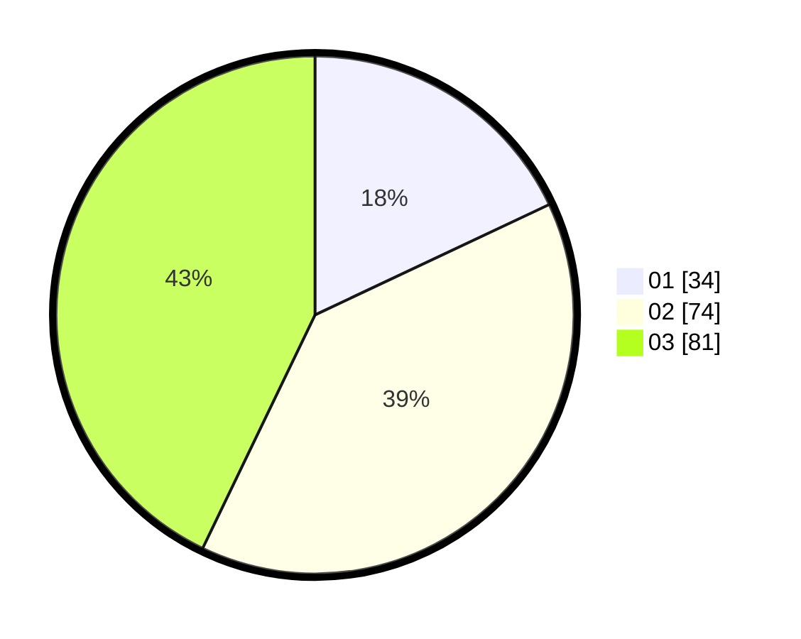

# Hasil

Hasil perolehan suara paslon dapat dilihat pada file paslon-01.txt, paslon-02.txt, dan paslon-03.txt.

Jika tidak ada, artinya data tersebut belum ada pada SIREKAP.

## Perolehan Suara

 * Paslon 01: **34**.
 * Paslon 02: **74**.
 * Paslon 03: **81**.

## Foto C Plano

https://sirekap-obj-formc.kpu.go.id/b0d1/pemilu/ppwp/31/73/04/10/04/3173041004092-20240214-191854--4c94d638-ca82-434d-9fb4-bfc3299e3bd5.jpg

https://sirekap-obj-formc.kpu.go.id/b0d1/pemilu/ppwp/31/73/04/10/04/3173041004092-20240214-191720--a719e529-2fd8-48f2-b5f4-c8365f6e56e1.jpg

https://sirekap-obj-formc.kpu.go.id/b0d1/pemilu/ppwp/31/73/04/10/04/3173041004092-20240214-190851--45f356f0-5cfe-4cdb-874e-7ff2babbbe02.jpg

## DATA PEMILIH TETAP

Jumlah pemilih dalam DPT: **269**.
 * L: **130**.
 * P: **139**.

## DATA PENGGUNA HAK PILIH

Jumlah pengguna hak pilih dalam DPT: **190**.
 * L: **93**.
 * P: **97**.

Jumlah pengguna hak pilih dalam DPTb: **0**.
 * L: **0**.
 * P: **0**.

Jumlah pengguna hak pilih dalam DPK: **3**.
 * L: **1**.
 * P: **2**.

Jumlah pengguna hak pilih: **193**.
 * L: **94**.
 * P: **99**.

## JUMLAH SUARA SAH DAN TIDAK SAH

JUMLAH SELURUH SUARA SAH: **189**.

JUMLAH SUARA TIDAK SAH: **4**.

JUMLAH SELURUH SUARA SAH DAN SUARA TIDAK SAH: **193**.
