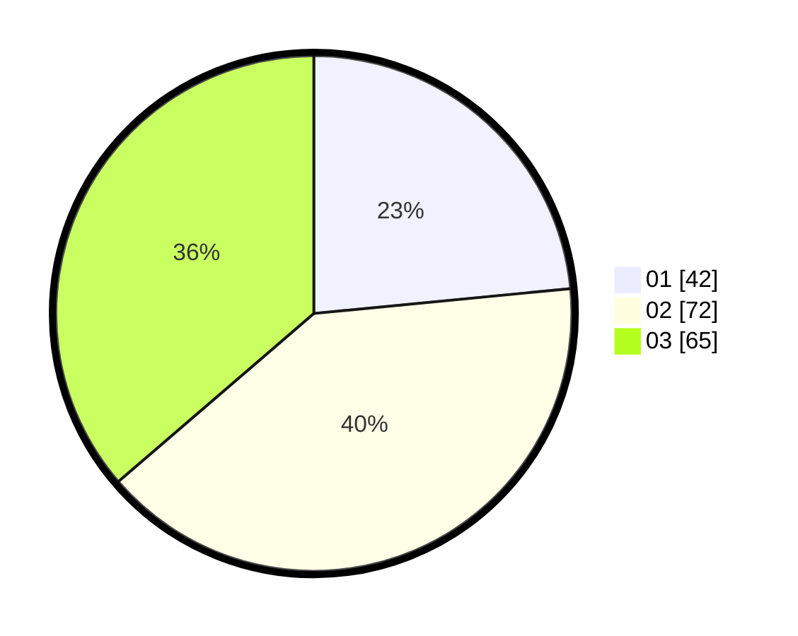

# Hasil

Hasil perolehan suara paslon dapat dilihat pada file paslon-01.txt, paslon-02.txt, dan paslon-03.txt.

Jika tidak ada, artinya data tersebut belum ada pada SIREKAP.

## Perolehan Suara

 * Paslon 01: **42**.
 * Paslon 02: **72**.
 * Paslon 03: **65**.

## Foto C Plano

https://sirekap-obj-formc.kpu.go.id/53bf/pemilu/ppwp/31/73/04/10/04/3173041004093-20240214-185133--d9090830-5d3c-4a3f-a341-c977e0f072cf.jpg

https://sirekap-obj-formc.kpu.go.id/53bf/pemilu/ppwp/31/73/04/10/04/3173041004093-20240214-185124--477bca2a-4ce6-40db-b4a4-d2afd0ecab8f.jpg

https://sirekap-obj-formc.kpu.go.id/53bf/pemilu/ppwp/31/73/04/10/04/3173041004093-20240214-185241--e7ed3118-614e-4307-85ce-bd5eb91e924b.jpg

## DATA PEMILIH TETAP

Jumlah pemilih dalam DPT: **244**.
 * L: **124**.
 * P: **120**.

## DATA PENGGUNA HAK PILIH

Jumlah pengguna hak pilih dalam DPT: **779**.
 * L: **94**.
 * P: **887**.

Jumlah pengguna hak pilih dalam DPTb: **0**.
 * L: **0**.
 * P: **80**.

Jumlah pengguna hak pilih dalam DPK: **803**.
 * L: **832**.
 * P: **881**.

Jumlah pengguna hak pilih: **582**.
 * L: **96**.
 * P: **86**.

## JUMLAH SUARA SAH DAN TIDAK SAH

JUMLAH SELURUH SUARA SAH: **179**.

JUMLAH SUARA TIDAK SAH: **3**.

JUMLAH SELURUH SUARA SAH DAN SUARA TIDAK SAH: **182**.
