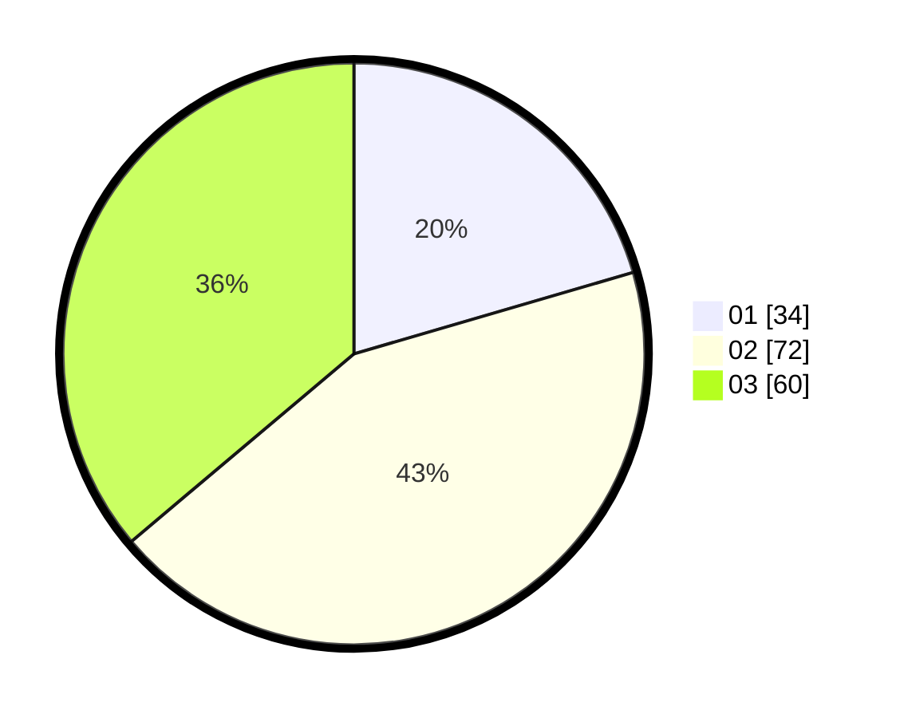

# Hasil

Hasil perolehan suara paslon dapat dilihat pada file paslon-01.txt, paslon-02.txt, dan paslon-03.txt.

Jika tidak ada, artinya data tersebut belum ada pada SIREKAP.

## Perolehan Suara

 * Paslon 01: **34**.
 * Paslon 02: **72**.
 * Paslon 03: **60**.

## Foto C Plano

https://sirekap-obj-formc.kpu.go.id/344a/pemilu/ppwp/31/73/04/10/05/3173041005003-20240214-190024--ec1168a1-bf9f-4bb4-88f7-911d2791784e.jpg

https://sirekap-obj-formc.kpu.go.id/344a/pemilu/ppwp/31/73/04/10/05/3173041005003-20240215-212834--43112e8c-5949-4e73-9412-1d3717803286.jpg

https://sirekap-obj-formc.kpu.go.id/344a/pemilu/ppwp/31/73/04/10/05/3173041005003-20240214-190051--90c14099-a8fb-4b70-9a32-930e80f291c5.jpg

## DATA PEMILIH TETAP

Jumlah pemilih dalam DPT: **272**.
 * L: **140**.
 * P: **132**.

## DATA PENGGUNA HAK PILIH

Jumlah pengguna hak pilih dalam DPT: **169**.
 * L: **85**.
 * P: **84**.

Jumlah pengguna hak pilih dalam DPTb: **0**.
 * L: **0**.
 * P: **0**.

Jumlah pengguna hak pilih dalam DPK: **1**.
 * L: **1**.
 * P: **0**.

Jumlah pengguna hak pilih: **170**.
 * L: **86**.
 * P: **84**.

## JUMLAH SUARA SAH DAN TIDAK SAH

JUMLAH SELURUH SUARA SAH: **166**.

JUMLAH SUARA TIDAK SAH: **4**.

JUMLAH SELURUH SUARA SAH DAN SUARA TIDAK SAH: **170**.
