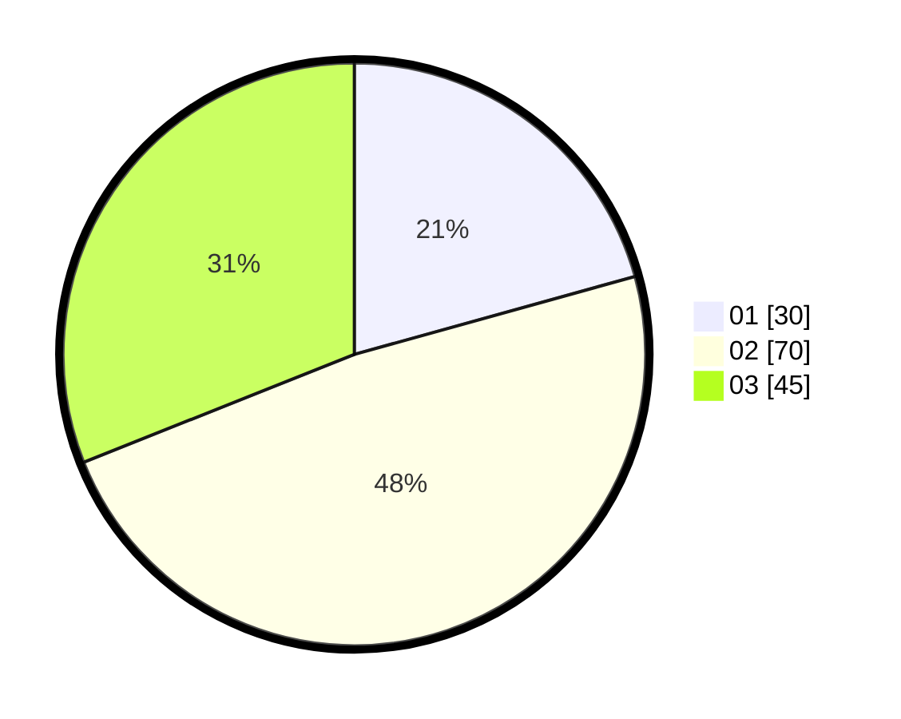

# Hasil

Hasil perolehan suara paslon dapat dilihat pada file paslon-01.txt, paslon-02.txt, dan paslon-03.txt.

Jika tidak ada, artinya data tersebut belum ada pada SIREKAP.

## Perolehan Suara

 * Paslon 01: **30**.
 * Paslon 02: **70**.
 * Paslon 03: **45**.

## Foto C Plano

https://sirekap-obj-formc.kpu.go.id/fe0b/pemilu/ppwp/31/73/04/10/05/3173041005006-20240215-143024--50158e2c-75ce-4979-82ab-68094250a659.jpg

https://sirekap-obj-formc.kpu.go.id/fe0b/pemilu/ppwp/31/73/04/10/05/3173041005006-20240215-143046--c6c9cd99-6404-4428-b94c-42cf310cb9eb.jpg

https://sirekap-obj-formc.kpu.go.id/fe0b/pemilu/ppwp/31/73/04/10/05/3173041005006-20240215-143036--e39fa37a-6b1a-48e5-8e3a-33493f2a764b.jpg

## DATA PEMILIH TETAP

Jumlah pemilih dalam DPT: **277**.
 * L: **142**.
 * P: **135**.

## DATA PENGGUNA HAK PILIH

Jumlah pengguna hak pilih dalam DPT: **146**.
 * L: **71**.
 * P: **75**.

Jumlah pengguna hak pilih dalam DPTb: **0**.
 * L: **0**.
 * P: **0**.

Jumlah pengguna hak pilih dalam DPK: **0**.
 * L: **0**.
 * P: **0**.

Jumlah pengguna hak pilih: **146**.
 * L: **71**.
 * P: **75**.

## JUMLAH SUARA SAH DAN TIDAK SAH

JUMLAH SELURUH SUARA SAH: **145**.

JUMLAH SUARA TIDAK SAH: **1**.

JUMLAH SELURUH SUARA SAH DAN SUARA TIDAK SAH: **146**.
