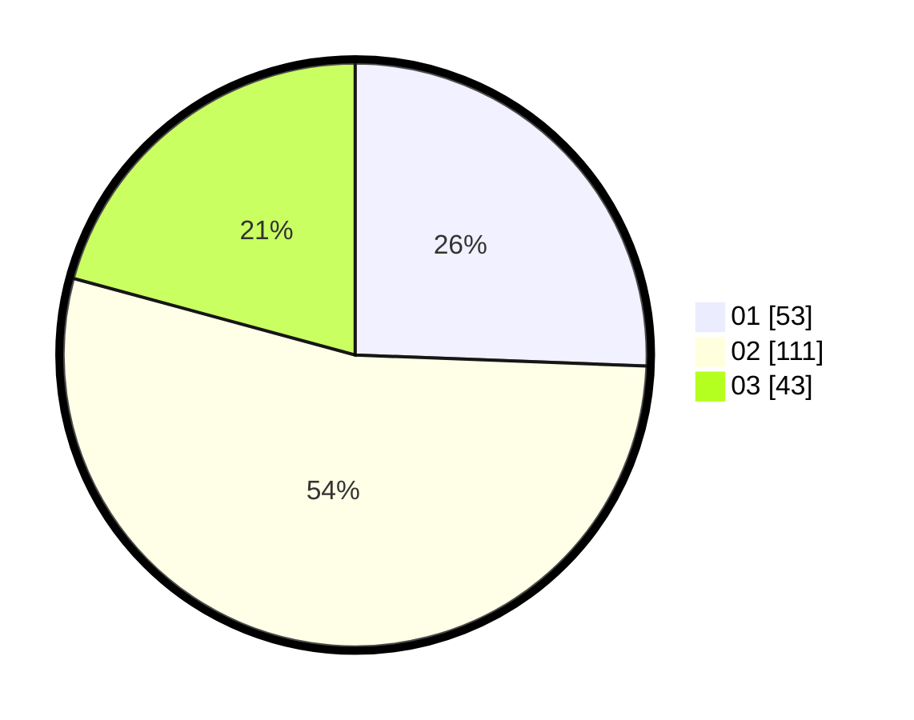

# Hasil

Hasil perolehan suara paslon dapat dilihat pada file paslon-01.txt, paslon-02.txt, dan paslon-03.txt.

Jika tidak ada, artinya data tersebut belum ada pada SIREKAP.

## Perolehan Suara

 * Paslon 01: **53**.
 * Paslon 02: **111**.
 * Paslon 03: **43**.

## Foto C Plano

https://sirekap-obj-formc.kpu.go.id/bf12/pemilu/ppwp/31/73/04/10/05/3173041005008-20240214-190420--660fbb67-ede8-4ea1-9c79-0f36629841eb.jpg

https://sirekap-obj-formc.kpu.go.id/bf12/pemilu/ppwp/31/73/04/10/05/3173041005008-20240214-190752--fc7ff793-c282-4be9-803a-e070e861a967.jpg

https://sirekap-obj-formc.kpu.go.id/bf12/pemilu/ppwp/31/73/04/10/05/3173041005008-20240214-191235--36b6a930-84da-4408-8c77-ed3b7370efa9.jpg

## DATA PEMILIH TETAP

Jumlah pemilih dalam DPT: **276**.
 * L: **134**.
 * P: **142**.

## DATA PENGGUNA HAK PILIH

Jumlah pengguna hak pilih dalam DPT: **211**.
 * L: **106**.
 * P: **105**.

Jumlah pengguna hak pilih dalam DPTb: **1**.
 * L: **1**.
 * P: **0**.

Jumlah pengguna hak pilih dalam DPK: **0**.
 * L: **0**.
 * P: **0**.

Jumlah pengguna hak pilih: **212**.
 * L: **107**.
 * P: **105**.

## JUMLAH SUARA SAH DAN TIDAK SAH

JUMLAH SELURUH SUARA SAH: **207**.

JUMLAH SUARA TIDAK SAH: **5**.

JUMLAH SELURUH SUARA SAH DAN SUARA TIDAK SAH: **212**.
