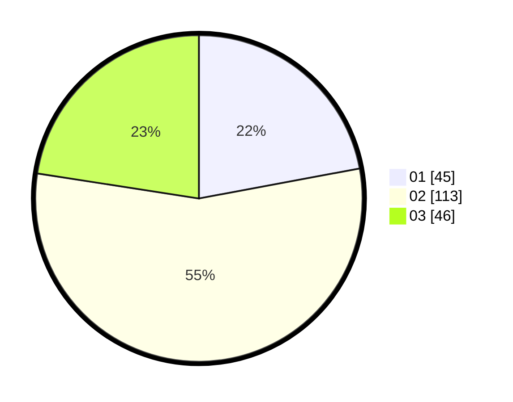

# Hasil

Hasil perolehan suara paslon dapat dilihat pada file paslon-01.txt, paslon-02.txt, dan paslon-03.txt.

Jika tidak ada, artinya data tersebut belum ada pada SIREKAP.

## Perolehan Suara

 * Paslon 01: **45**.
 * Paslon 02: **113**.
 * Paslon 03: **46**.

## Foto C Plano

https://sirekap-obj-formc.kpu.go.id/4404/pemilu/ppwp/31/73/04/10/05/3173041005012-20240216-053947--8663703b-1f19-4e7a-b24d-41242217e595.jpg

https://sirekap-obj-formc.kpu.go.id/4404/pemilu/ppwp/31/73/04/10/05/3173041005012-20240216-053949--976a86af-1c41-4a23-bf9d-736e236de764.jpg

https://sirekap-obj-formc.kpu.go.id/4404/pemilu/ppwp/31/73/04/10/05/3173041005012-20240216-053948--3927c6a7-f1b7-4641-a5ed-f9a2f456cf59.jpg

## DATA PEMILIH TETAP

Jumlah pemilih dalam DPT: **265**.
 * L: **132**.
 * P: **133**.

## DATA PENGGUNA HAK PILIH

Jumlah pengguna hak pilih dalam DPT: **197**.
 * L: **102**.
 * P: **95**.

Jumlah pengguna hak pilih dalam DPTb: **0**.
 * L: **0**.
 * P: **0**.

Jumlah pengguna hak pilih dalam DPK: **8**.
 * L: **4**.
 * P: **4**.

Jumlah pengguna hak pilih: **205**.
 * L: **106**.
 * P: **99**.

## JUMLAH SUARA SAH DAN TIDAK SAH

JUMLAH SELURUH SUARA SAH: **204**.

JUMLAH SUARA TIDAK SAH: **1**.

JUMLAH SELURUH SUARA SAH DAN SUARA TIDAK SAH: **205**.
