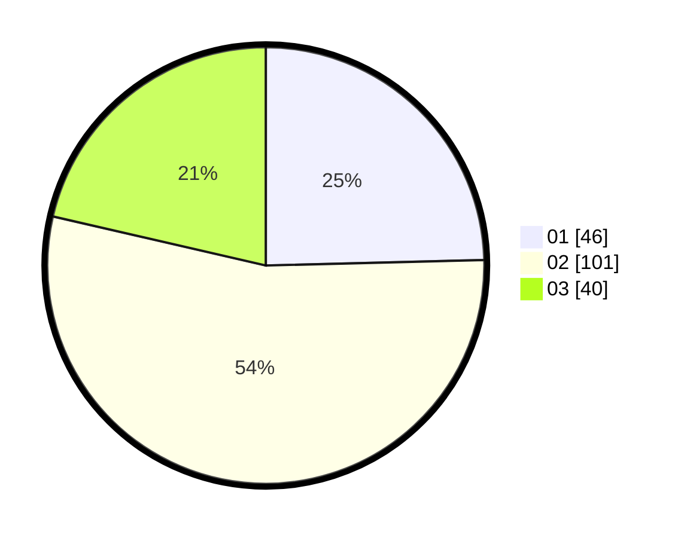

# Hasil

Hasil perolehan suara paslon dapat dilihat pada file paslon-01.txt, paslon-02.txt, dan paslon-03.txt.

Jika tidak ada, artinya data tersebut belum ada pada SIREKAP.

## Perolehan Suara

 * Paslon 01: **46**.
 * Paslon 02: **101**.
 * Paslon 03: **40**.

## Foto C Plano

https://sirekap-obj-formc.kpu.go.id/f0dd/pemilu/ppwp/31/73/04/10/05/3173041005013-20240214-231339--c3add4a4-fb7c-4cd8-8c42-129c1f35f59d.jpg

https://sirekap-obj-formc.kpu.go.id/f0dd/pemilu/ppwp/31/73/04/10/05/3173041005013-20240214-232819--49ba8b08-25ca-41d7-a82f-4a654ed298c3.jpg

https://sirekap-obj-formc.kpu.go.id/f0dd/pemilu/ppwp/31/73/04/10/05/3173041005013-20240214-232720--017ac617-d1a8-4f51-9ea9-41c3df5cdf9f.jpg

## DATA PEMILIH TETAP

Jumlah pemilih dalam DPT: **268**.
 * L: **124**.
 * P: **144**.

## DATA PENGGUNA HAK PILIH

Jumlah pengguna hak pilih dalam DPT: **171**.
 * L: **71**.
 * P: **100**.

Jumlah pengguna hak pilih dalam DPTb: **0**.
 * L: **0**.
 * P: **0**.

Jumlah pengguna hak pilih dalam DPK: **1**.
 * L: **1**.
 * P: **0**.

Jumlah pengguna hak pilih: **192**.
 * L: **92**.
 * P: **100**.

## JUMLAH SUARA SAH DAN TIDAK SAH

JUMLAH SELURUH SUARA SAH: **745**.

JUMLAH SUARA TIDAK SAH: **5**.

JUMLAH SELURUH SUARA SAH DAN SUARA TIDAK SAH: **192**.
