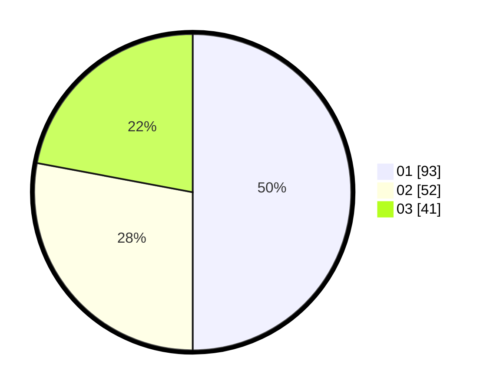

# Hasil

Hasil perolehan suara paslon dapat dilihat pada file paslon-01.txt, paslon-02.txt, dan paslon-03.txt.

Jika tidak ada, artinya data tersebut belum ada pada SIREKAP.

## Perolehan Suara

 * Paslon 01: **93**.
 * Paslon 02: **52**.
 * Paslon 03: **41**.

## Foto C Plano

https://sirekap-obj-formc.kpu.go.id/b789/pemilu/ppwp/31/73/04/10/05/3173041005014-20240214-201912--aa372ec4-3f6a-4036-85c5-802918f984b0.jpg

https://sirekap-obj-formc.kpu.go.id/b789/pemilu/ppwp/31/73/04/10/05/3173041005014-20240214-201943--669f4592-5e95-4ca3-9da1-139c9f30a634.jpg

https://sirekap-obj-formc.kpu.go.id/b789/pemilu/ppwp/31/73/04/10/05/3173041005014-20240214-201950--d8910613-7df4-40e1-b2ab-292df95bb62f.jpg

## DATA PEMILIH TETAP

Jumlah pemilih dalam DPT: **280**.
 * L: **150**.
 * P: **130**.

## DATA PENGGUNA HAK PILIH

Jumlah pengguna hak pilih dalam DPT: **187**.
 * L: **97**.
 * P: **90**.

Jumlah pengguna hak pilih dalam DPTb: **0**.
 * L: **0**.
 * P: **0**.

Jumlah pengguna hak pilih dalam DPK: **0**.
 * L: **0**.
 * P: **0**.

Jumlah pengguna hak pilih: **187**.
 * L: **97**.
 * P: **90**.

## JUMLAH SUARA SAH DAN TIDAK SAH

JUMLAH SELURUH SUARA SAH: **186**.

JUMLAH SUARA TIDAK SAH: **1**.

JUMLAH SELURUH SUARA SAH DAN SUARA TIDAK SAH: **187**.
