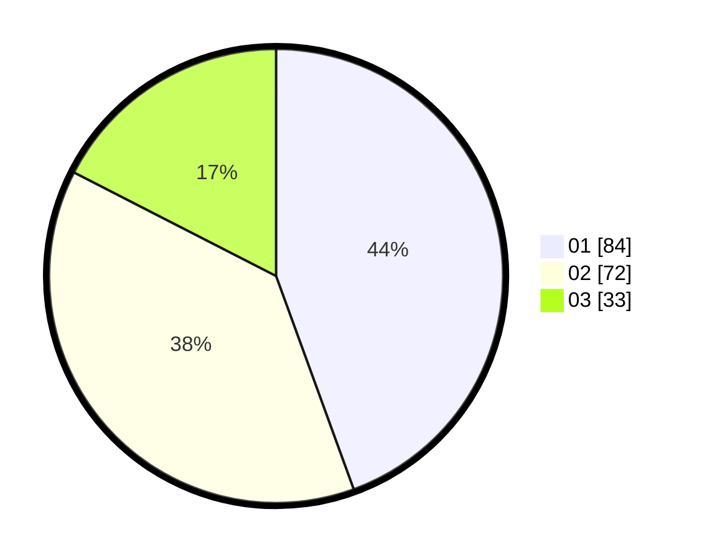

# Hasil

Hasil perolehan suara paslon dapat dilihat pada file paslon-01.txt, paslon-02.txt, dan paslon-03.txt.

Jika tidak ada, artinya data tersebut belum ada pada SIREKAP.

## Perolehan Suara

 * Paslon 01: **84**.
 * Paslon 02: **72**.
 * Paslon 03: **33**.

## Foto C Plano

https://sirekap-obj-formc.kpu.go.id/fdff/pemilu/ppwp/31/73/04/10/05/3173041005015-20240216-002745--f28872ef-bfd4-49ca-bd9d-897a42ab81a3.jpg

https://sirekap-obj-formc.kpu.go.id/fdff/pemilu/ppwp/31/73/04/10/05/3173041005015-20240216-002746--8b3b8be1-8f89-492e-bb6f-bdea297de9c2.jpg

https://sirekap-obj-formc.kpu.go.id/fdff/pemilu/ppwp/31/73/04/10/05/3173041005015-20240216-002746--a232b2af-ae56-402e-9e3a-0363bef691be.jpg

## DATA PEMILIH TETAP

Jumlah pemilih dalam DPT: **269**.
 * L: **138**.
 * P: **131**.

## DATA PENGGUNA HAK PILIH

Jumlah pengguna hak pilih dalam DPT: **187**.
 * L: **92**.
 * P: **95**.

Jumlah pengguna hak pilih dalam DPTb: **0**.
 * L: **0**.
 * P: **0**.

Jumlah pengguna hak pilih dalam DPK: **2**.
 * L: **1**.
 * P: **1**.

Jumlah pengguna hak pilih: **189**.
 * L: **93**.
 * P: **96**.

## JUMLAH SUARA SAH DAN TIDAK SAH

JUMLAH SELURUH SUARA SAH: **189**.

JUMLAH SUARA TIDAK SAH: **0**.

JUMLAH SELURUH SUARA SAH DAN SUARA TIDAK SAH: **189**.
