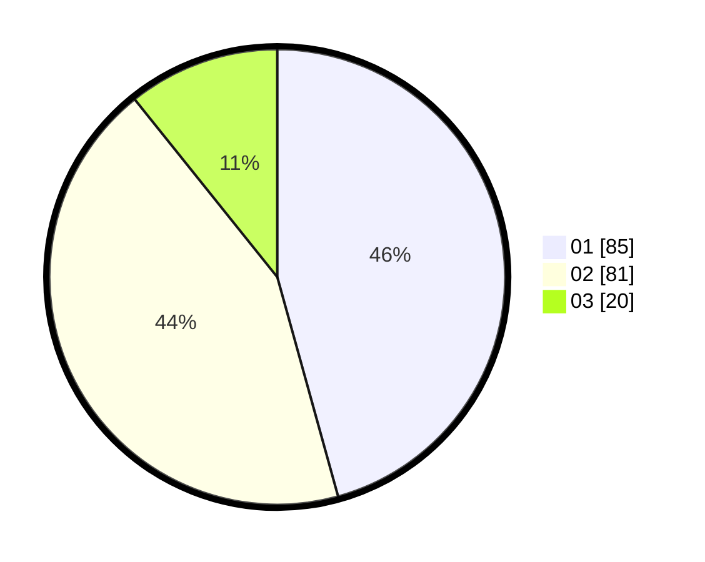

# Hasil

Hasil perolehan suara paslon dapat dilihat pada file paslon-01.txt, paslon-02.txt, dan paslon-03.txt.

Jika tidak ada, artinya data tersebut belum ada pada SIREKAP.

## Perolehan Suara

 * Paslon 01: **85**.
 * Paslon 02: **81**.
 * Paslon 03: **20**.

## Foto C Plano

https://sirekap-obj-formc.kpu.go.id/2b30/pemilu/ppwp/31/73/04/10/05/3173041005022-20240216-133530--09bbc20d-9580-4d4c-8c2c-d3091b936b45.jpg

https://sirekap-obj-formc.kpu.go.id/2b30/pemilu/ppwp/31/73/04/10/05/3173041005022-20240216-133531--768e14fa-24e5-4e04-8bf2-417a9eef825b.jpg

https://sirekap-obj-formc.kpu.go.id/2b30/pemilu/ppwp/31/73/04/10/05/3173041005022-20240216-133530--4378e684-3d43-4885-9572-fbab63fce5ac.jpg

## DATA PEMILIH TETAP

Jumlah pemilih dalam DPT: **250**.
 * L: **134**.
 * P: **116**.

## DATA PENGGUNA HAK PILIH

Jumlah pengguna hak pilih dalam DPT: **191**.
 * L: **102**.
 * P: **89**.

Jumlah pengguna hak pilih dalam DPTb: **1**.
 * L: **0**.
 * P: **1**.

Jumlah pengguna hak pilih dalam DPK: **1**.
 * L: **1**.
 * P: **0**.

Jumlah pengguna hak pilih: **193**.
 * L: **103**.
 * P: **90**.

## JUMLAH SUARA SAH DAN TIDAK SAH

JUMLAH SELURUH SUARA SAH: **186**.

JUMLAH SUARA TIDAK SAH: **7**.

JUMLAH SELURUH SUARA SAH DAN SUARA TIDAK SAH: **193**.
