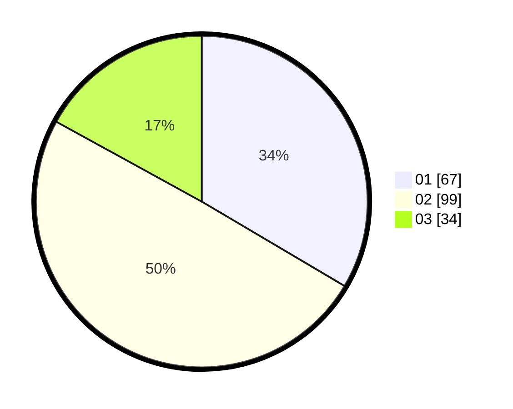

# Hasil

Hasil perolehan suara paslon dapat dilihat pada file paslon-01.txt, paslon-02.txt, dan paslon-03.txt.

Jika tidak ada, artinya data tersebut belum ada pada SIREKAP.

## Perolehan Suara

 * Paslon 01: **67**.
 * Paslon 02: **99**.
 * Paslon 03: **34**.

## Foto C Plano

https://sirekap-obj-formc.kpu.go.id/7639/pemilu/ppwp/31/73/04/10/05/3173041005024-20240214-155142--d904973d-627e-4563-88fa-01002e8dd0b6.jpg

https://sirekap-obj-formc.kpu.go.id/7639/pemilu/ppwp/31/73/04/10/05/3173041005024-20240214-155332--b79cd732-e6e1-4ae6-8a23-1d39adaead4f.jpg

https://sirekap-obj-formc.kpu.go.id/7639/pemilu/ppwp/31/73/04/10/05/3173041005024-20240214-155454--edaf0244-ca6f-4ac3-a760-e2b0ad392b68.jpg
