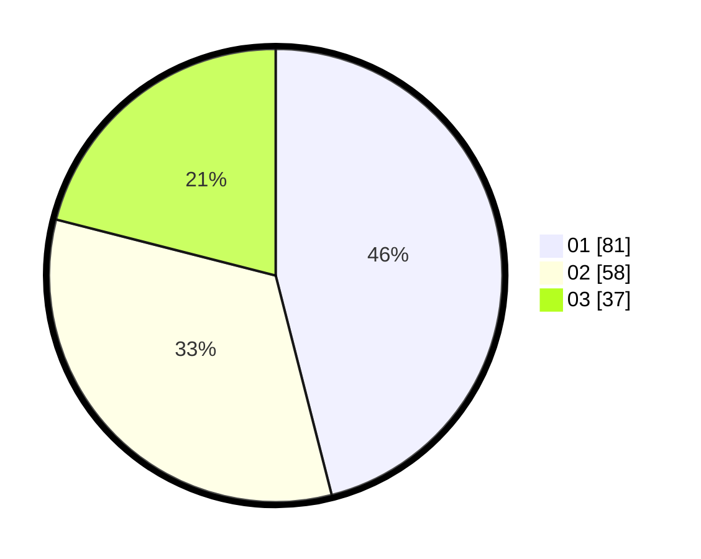

# Hasil

Hasil perolehan suara paslon dapat dilihat pada file paslon-01.txt, paslon-02.txt, dan paslon-03.txt.

Jika tidak ada, artinya data tersebut belum ada pada SIREKAP.

## Perolehan Suara

 * Paslon 01: **81**.
 * Paslon 02: **58**.
 * Paslon 03: **37**.

## Foto C Plano

https://sirekap-obj-formc.kpu.go.id/1234/pemilu/ppwp/31/73/04/10/05/3173041005028-20240214-193331--c99cb221-d9f6-49a6-bc27-0851f49322b0.jpg

https://sirekap-obj-formc.kpu.go.id/1234/pemilu/ppwp/31/73/04/10/05/3173041005028-20240215-234237--2b057500-e2c0-489f-b42f-1702a37bc9e2.jpg

https://sirekap-obj-formc.kpu.go.id/1234/pemilu/ppwp/31/73/04/10/05/3173041005028-20240215-234235--f962bbe9-f313-4eaf-99f3-7a35ff725508.jpg

## DATA PEMILIH TETAP

Jumlah pemilih dalam DPT: **248**.
 * L: **133**.
 * P: **115**.

## DATA PENGGUNA HAK PILIH

Jumlah pengguna hak pilih dalam DPT: **176**.
 * L: **92**.
 * P: **84**.

Jumlah pengguna hak pilih dalam DPTb: **5**.
 * L: **2**.
 * P: **3**.

Jumlah pengguna hak pilih dalam DPK: **0**.
 * L: **0**.
 * P: **0**.

Jumlah pengguna hak pilih: **181**.
 * L: **94**.
 * P: **87**.

## JUMLAH SUARA SAH DAN TIDAK SAH

JUMLAH SELURUH SUARA SAH: **176**.

JUMLAH SUARA TIDAK SAH: **5**.

JUMLAH SELURUH SUARA SAH DAN SUARA TIDAK SAH: **181**.
