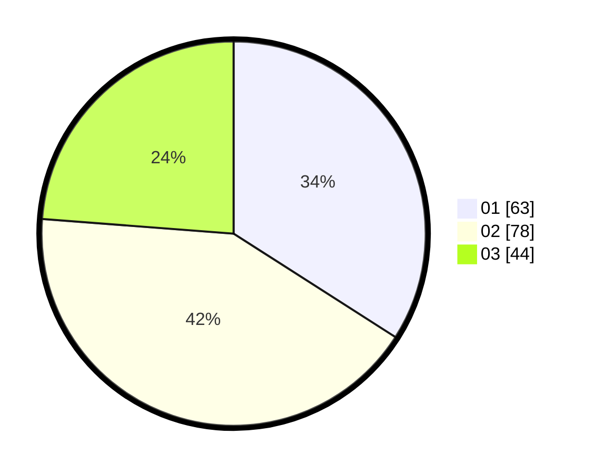

# Hasil

Hasil perolehan suara paslon dapat dilihat pada file paslon-01.txt, paslon-02.txt, dan paslon-03.txt.

Jika tidak ada, artinya data tersebut belum ada pada SIREKAP.

## Perolehan Suara

 * Paslon 01: **63**.
 * Paslon 02: **78**.
 * Paslon 03: **44**.

## Foto C Plano

https://sirekap-obj-formc.kpu.go.id/f770/pemilu/ppwp/31/73/04/10/05/3173041005029-20240214-214226--88284d70-8145-4e3d-ba19-a8a02884878d.jpg

https://sirekap-obj-formc.kpu.go.id/f770/pemilu/ppwp/31/73/04/10/05/3173041005029-20240214-214350--d9a38ffc-45a7-4272-b664-dc0e17874035.jpg
