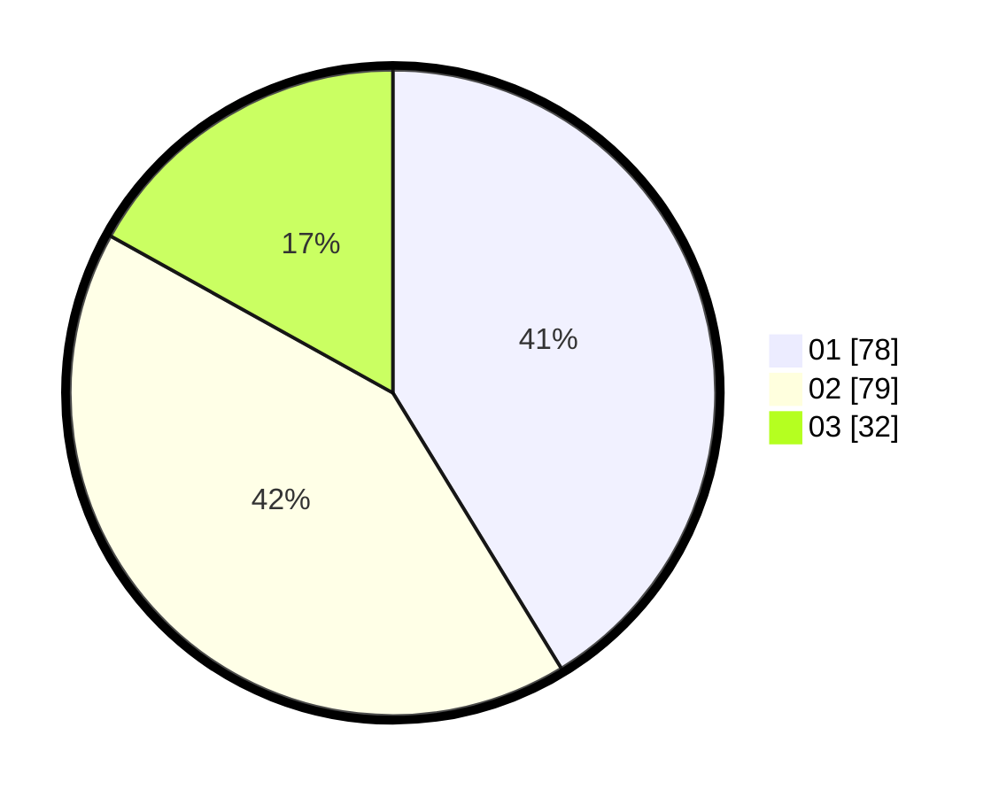

# Hasil

Hasil perolehan suara paslon dapat dilihat pada file paslon-01.txt, paslon-02.txt, dan paslon-03.txt.

Jika tidak ada, artinya data tersebut belum ada pada SIREKAP.

## Perolehan Suara

 * Paslon 01: **78**.
 * Paslon 02: **79**.
 * Paslon 03: **32**.

## Foto C Plano

https://sirekap-obj-formc.kpu.go.id/ccb5/pemilu/ppwp/31/73/04/10/05/3173041005031-20240214-220355--23e6edc9-a5b0-4993-acba-7e082aa1deaf.jpg

https://sirekap-obj-formc.kpu.go.id/ccb5/pemilu/ppwp/31/73/04/10/05/3173041005031-20240214-220419--265c2454-b39c-4836-9eef-499aa4f3b33d.jpg

https://sirekap-obj-formc.kpu.go.id/ccb5/pemilu/ppwp/31/73/04/10/05/3173041005031-20240214-220406--375cada5-7972-4e40-b67a-24198377d3ae.jpg

## DATA PEMILIH TETAP

Jumlah pemilih dalam DPT: **254**.
 * L: **125**.
 * P: **129**.

## DATA PENGGUNA HAK PILIH

Jumlah pengguna hak pilih dalam DPT: **189**.
 * L: **95**.
 * P: **94**.

Jumlah pengguna hak pilih dalam DPTb: **0**.
 * L: **0**.
 * P: **0**.

Jumlah pengguna hak pilih dalam DPK: **3**.
 * L: **0**.
 * P: **3**.

Jumlah pengguna hak pilih: **192**.
 * L: **95**.
 * P: **97**.

## JUMLAH SUARA SAH DAN TIDAK SAH

JUMLAH SELURUH SUARA SAH: **189**.

JUMLAH SUARA TIDAK SAH: **3**.

JUMLAH SELURUH SUARA SAH DAN SUARA TIDAK SAH: **192**.
