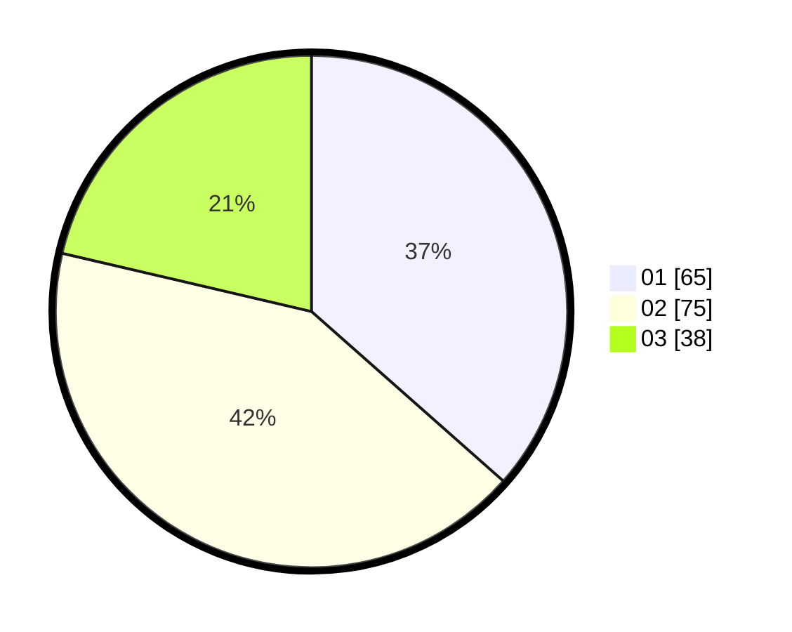

# Hasil

Hasil perolehan suara paslon dapat dilihat pada file paslon-01.txt, paslon-02.txt, dan paslon-03.txt.

Jika tidak ada, artinya data tersebut belum ada pada SIREKAP.

## Perolehan Suara

 * Paslon 01: **65**.
 * Paslon 02: **75**.
 * Paslon 03: **38**.

## Foto C Plano

https://sirekap-obj-formc.kpu.go.id/b9df/pemilu/ppwp/31/73/04/10/05/3173041005036-20240214-191003--b55e27a5-4047-4cdb-aa6b-c7cb0bf51cbd.jpg

https://sirekap-obj-formc.kpu.go.id/b9df/pemilu/ppwp/31/73/04/10/05/3173041005036-20240215-015333--cbcb1300-821f-4628-a027-8686d1724bd2.jpg

https://sirekap-obj-formc.kpu.go.id/b9df/pemilu/ppwp/31/73/04/10/05/3173041005036-20240215-015254--9f6fafdc-92fa-4e56-891e-0bf6650903c2.jpg

## DATA PEMILIH TETAP

Jumlah pemilih dalam DPT: **262**.
 * L: **137**.
 * P: **125**.

## DATA PENGGUNA HAK PILIH

Jumlah pengguna hak pilih dalam DPT: **178**.
 * L: **97**.
 * P: **81**.

Jumlah pengguna hak pilih dalam DPTb: **0**.
 * L: **0**.
 * P: **0**.

Jumlah pengguna hak pilih dalam DPK: **0**.
 * L: **0**.
 * P: **0**.

Jumlah pengguna hak pilih: **178**.
 * L: **97**.
 * P: **81**.

## JUMLAH SUARA SAH DAN TIDAK SAH

JUMLAH SELURUH SUARA SAH: **178**.

JUMLAH SUARA TIDAK SAH: **0**.

JUMLAH SELURUH SUARA SAH DAN SUARA TIDAK SAH: **178**.
