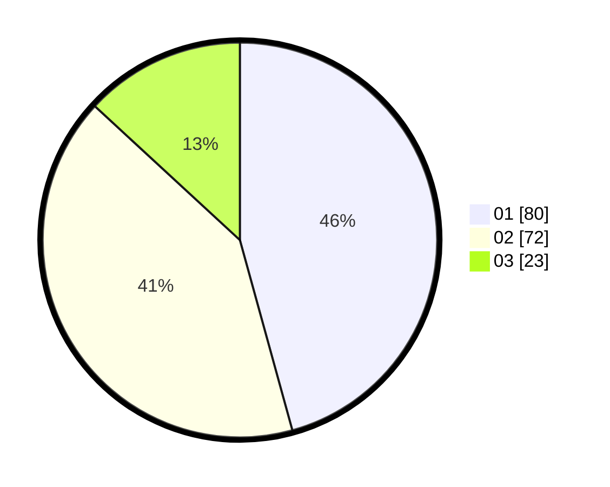

# Hasil

Hasil perolehan suara paslon dapat dilihat pada file paslon-01.txt, paslon-02.txt, dan paslon-03.txt.

Jika tidak ada, artinya data tersebut belum ada pada SIREKAP.

## Perolehan Suara

 * Paslon 01: **80**.
 * Paslon 02: **72**.
 * Paslon 03: **23**.

## Foto C Plano

https://sirekap-obj-formc.kpu.go.id/2149/pemilu/ppwp/31/73/04/10/05/3173041005039-20240215-185717--1deff02a-bca2-4686-ab8d-27968d8d4b8c.jpg

https://sirekap-obj-formc.kpu.go.id/2149/pemilu/ppwp/31/73/04/10/05/3173041005039-20240215-185747--b5ba06e2-4244-4038-9558-c934133eae82.jpg

https://sirekap-obj-formc.kpu.go.id/2149/pemilu/ppwp/31/73/04/10/05/3173041005039-20240215-185729--f4f6c096-df2b-489e-a7e3-f549dfb839cf.jpg

## DATA PEMILIH TETAP

Jumlah pemilih dalam DPT: **264**.
 * L: **142**.
 * P: **122**.

## DATA PENGGUNA HAK PILIH

Jumlah pengguna hak pilih dalam DPT: **175**.
 * L: **92**.
 * P: **83**.

Jumlah pengguna hak pilih dalam DPTb: **1**.
 * L: **0**.
 * P: **1**.

Jumlah pengguna hak pilih dalam DPK: **3**.
 * L: **2**.
 * P: **1**.

Jumlah pengguna hak pilih: **179**.
 * L: **94**.
 * P: **85**.

## JUMLAH SUARA SAH DAN TIDAK SAH

JUMLAH SELURUH SUARA SAH: **175**.

JUMLAH SUARA TIDAK SAH: **4**.

JUMLAH SELURUH SUARA SAH DAN SUARA TIDAK SAH: **179**.
