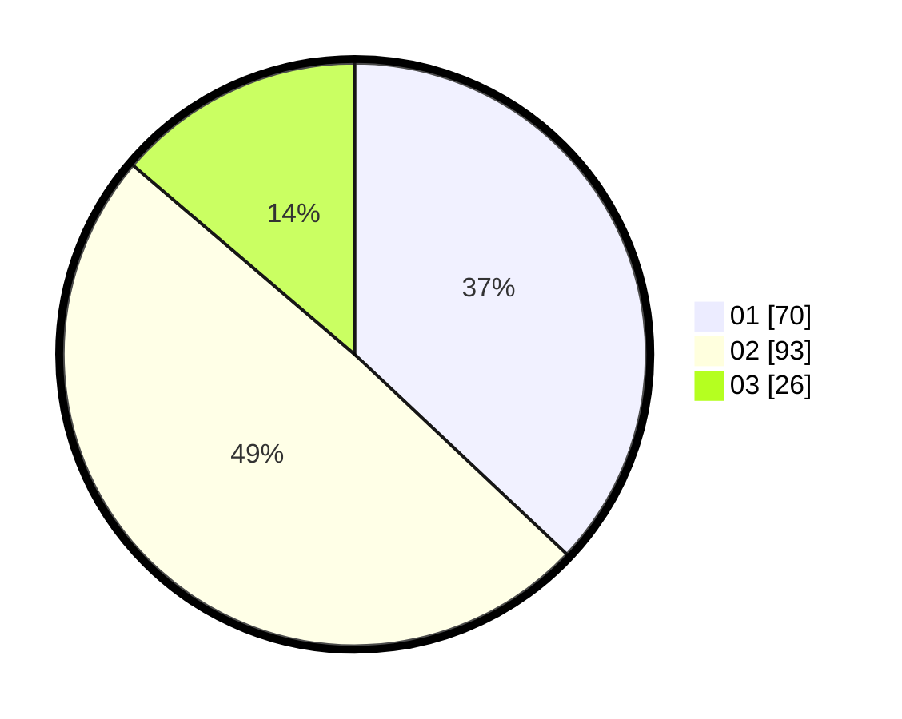

# Hasil

Hasil perolehan suara paslon dapat dilihat pada file paslon-01.txt, paslon-02.txt, dan paslon-03.txt.

Jika tidak ada, artinya data tersebut belum ada pada SIREKAP.

## Perolehan Suara

 * Paslon 01: **70**.
 * Paslon 02: **93**.
 * Paslon 03: **26**.

## Foto C Plano

https://sirekap-obj-formc.kpu.go.id/8073/pemilu/ppwp/31/73/04/10/05/3173041005040-20240215-210328--f5d2b26d-8241-45af-88c1-2652a663fc42.jpg

https://sirekap-obj-formc.kpu.go.id/8073/pemilu/ppwp/31/73/04/10/05/3173041005040-20240215-210331--bf0c030f-3a23-45eb-bffd-f7775e5361ba.jpg

https://sirekap-obj-formc.kpu.go.id/8073/pemilu/ppwp/31/73/04/10/05/3173041005040-20240215-210330--38a107f8-a09f-4998-9d53-195da06fbc31.jpg

## DATA PEMILIH TETAP

Jumlah pemilih dalam DPT: **270**.
 * L: **146**.
 * P: **124**.

## DATA PENGGUNA HAK PILIH

Jumlah pengguna hak pilih dalam DPT: **186**.
 * L: **95**.
 * P: **91**.

Jumlah pengguna hak pilih dalam DPTb: **0**.
 * L: **0**.
 * P: **0**.

Jumlah pengguna hak pilih dalam DPK: **4**.
 * L: **3**.
 * P: **1**.

Jumlah pengguna hak pilih: **190**.
 * L: **98**.
 * P: **92**.

## JUMLAH SUARA SAH DAN TIDAK SAH

JUMLAH SELURUH SUARA SAH: **189**.

JUMLAH SUARA TIDAK SAH: **1**.

JUMLAH SELURUH SUARA SAH DAN SUARA TIDAK SAH: **190**.
