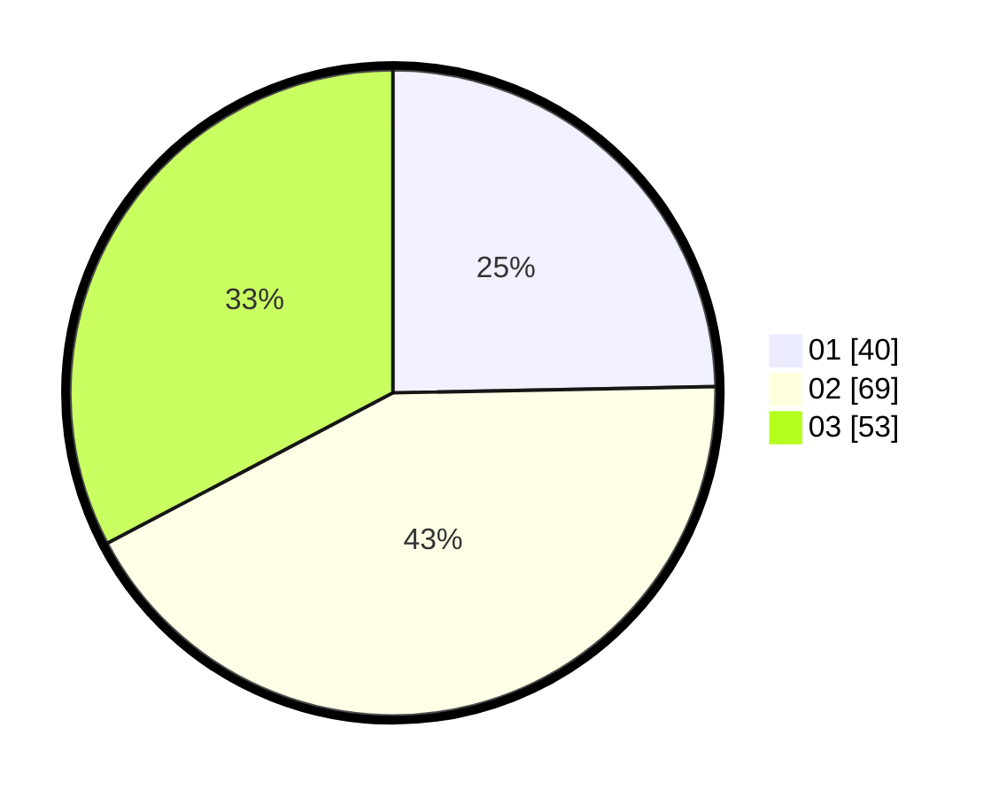

# Hasil

Hasil perolehan suara paslon dapat dilihat pada file paslon-01.txt, paslon-02.txt, dan paslon-03.txt.

Jika tidak ada, artinya data tersebut belum ada pada SIREKAP.

## Perolehan Suara

 * Paslon 01: **40**.
 * Paslon 02: **69**.
 * Paslon 03: **53**.

## Foto C Plano

https://sirekap-obj-formc.kpu.go.id/b989/pemilu/ppwp/31/73/04/10/05/3173041005042-20240214-213600--56364df9-33dd-4d89-acd4-00bfd6688daa.jpg

https://sirekap-obj-formc.kpu.go.id/b989/pemilu/ppwp/31/73/04/10/05/3173041005042-20240214-213831--f105af8b-3aa4-41e0-8d77-232c305c0ebe.jpg

https://sirekap-obj-formc.kpu.go.id/b989/pemilu/ppwp/31/73/04/10/05/3173041005042-20240214-214027--d92e5d5f-b91f-43d1-9512-114bbb1bad02.jpg
